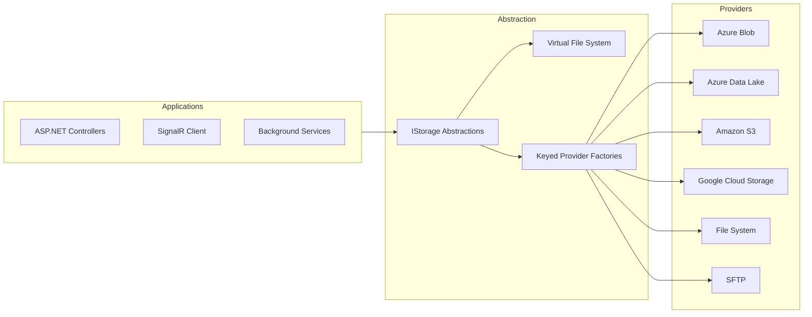
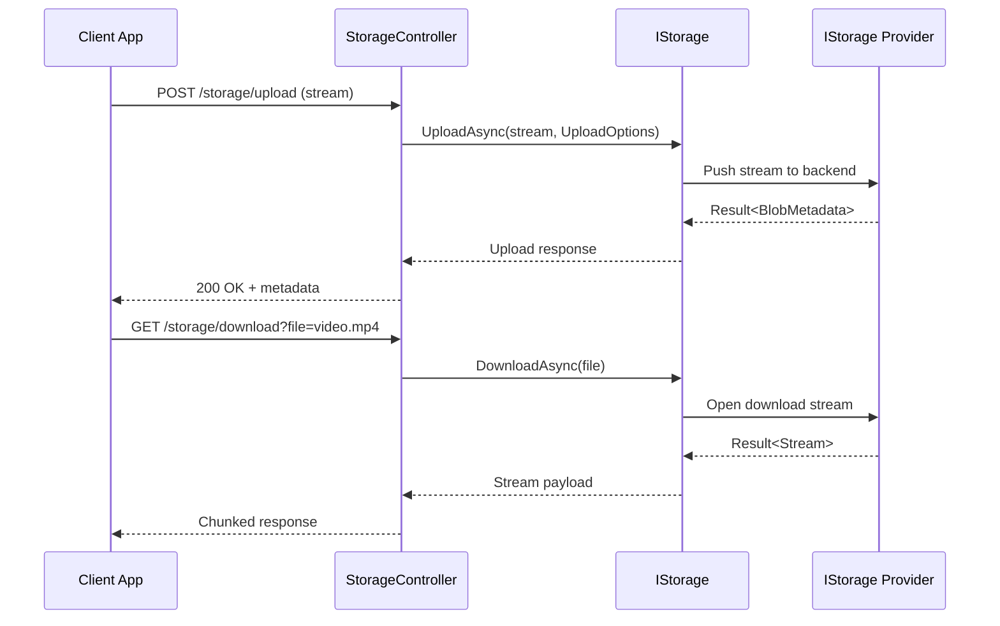

# ManagedCode.Storage

[](https://github.com/managedcode/Storage/actions/workflows/ci.yml)
[](https://github.com/managedcode/Storage/actions/workflows/release.yml)
[](https://github.com/managedcode/Storage/actions/workflows/codeql-analysis.yml)
[](https://codecov.io/gh/managedcode/Storage)
[](https://sonarcloud.io/summary/new_code?id=managedcode_Storage)
[](https://sonarcloud.io/summary/new_code?id=managedcode_Storage)
[](LICENSE)
[](https://www.nuget.org/packages/ManagedCode.Storage.Core)

Cross-provider blob storage toolkit for .NET and ASP.NET streaming scenarios.

ManagedCode.Storage wraps vendor SDKs behind a single `IStorage` abstraction so uploads, downloads, metadata, streaming, and retention behave the same regardless of provider. Swap between Azure Blob Storage, Azure Data Lake, Amazon S3, Google Cloud Storage, SFTP, a local file system, or the in-memory Virtual File System without rewriting application code. Pair it with our ASP.NET controllers and SignalR client to deliver chunked uploads, ranged downloads, and progress notifications end to end.

## Motivation

Cloud storage vendors expose distinct SDKs, option models, and authentication patterns. That makes it painful to change providers, run multi-region replication, or stand up hermetic tests. ManagedCode.Storage gives you a universal surface, consistent `Result<T>` handling, and DI-aware registration helpers so you can plug in any provider, test locally, and keep the same code paths in production.

## Features

- Unified `IStorage` abstraction covering upload, download, streaming, metadata, deletion, container management, and legal hold operations backed by `Result<T>` responses.
- Provider coverage across Azure Blob Storage, Azure Data Lake, Amazon S3, Google Cloud Storage, SFTP, local file system, and the in-memory Virtual File System (VFS).
- Keyed dependency-injection registrations plus default provider helpers to fan out files per tenant, region, or workload without manual service plumbing.
- ASP.NET storage controllers, chunk orchestration services, and a SignalR hub/client pair that deliver resumable uploads, ranged downloads, CRC32 validation, and real-time progress.
- `ManagedCode.Storage.Client` brings streaming uploads/downloads, CRC32 helpers, and MIME discovery via `MimeHelper` to any .NET app.
- Strongly typed option objects (`UploadOptions`, `DownloadOptions`, `DeleteOptions`, `MetadataOptions`, `LegalHoldOptions`, etc.) let you configure directories, metadata, and legal holds in one place.
- Virtual File System package keeps everything in memory for lightning-fast tests, developer sandboxes, and local demos while still exercising the same abstractions.
- Comprehensive automated test suite with cross-provider sync fixtures, multi-gigabyte streaming simulations (4 MB units per "GB"), ASP.NET controller harnesses, and SFTP/local filesystem coverage.
- ManagedCode.Storage.TestFakes package plus Testcontainers-based fixtures make it easy to run offline or CI tests without touching real cloud accounts.

## Packages

### Core & Utilities

| Package | Latest | Description |
| --- | --- | --- |
| [ManagedCode.Storage.Core](https://www.nuget.org/packages/ManagedCode.Storage.Core) | [](https://www.nuget.org/packages/ManagedCode.Storage.Core) | Core abstractions, option models, CRC32/MIME helpers, and DI extensions. |
| [ManagedCode.Storage.VirtualFileSystem](https://www.nuget.org/packages/ManagedCode.Storage.VirtualFileSystem) | [](https://www.nuget.org/packages/ManagedCode.Storage.VirtualFileSystem) | In-memory storage built on the `IStorage` surface for tests and sandboxes. |
| [ManagedCode.Storage.TestFakes](https://www.nuget.org/packages/ManagedCode.Storage.TestFakes) | [](https://www.nuget.org/packages/ManagedCode.Storage.TestFakes) | Provider doubles for unit/integration tests without hitting cloud services. |

### Providers

| Package | Latest | Description |
| --- | --- | --- |
| [ManagedCode.Storage.Azure](https://www.nuget.org/packages/ManagedCode.Storage.Azure) | [](https://www.nuget.org/packages/ManagedCode.Storage.Azure) | Azure Blob Storage implementation with metadata, streaming, and legal hold support. |
| [ManagedCode.Storage.Azure.DataLake](https://www.nuget.org/packages/ManagedCode.Storage.Azure.DataLake) | [](https://www.nuget.org/packages/ManagedCode.Storage.Azure.DataLake) | Azure Data Lake Gen2 provider on top of the unified abstraction. |
| [ManagedCode.Storage.Aws](https://www.nuget.org/packages/ManagedCode.Storage.Aws) | [](https://www.nuget.org/packages/ManagedCode.Storage.Aws) | Amazon S3 provider with Object Lock and legal hold operations. |
| [ManagedCode.Storage.Gcp](https://www.nuget.org/packages/ManagedCode.Storage.Gcp) | [](https://www.nuget.org/packages/ManagedCode.Storage.Gcp) | Google Cloud Storage integration built on official SDKs. |
| [ManagedCode.Storage.FileSystem](https://www.nuget.org/packages/ManagedCode.Storage.FileSystem) | [](https://www.nuget.org/packages/ManagedCode.Storage.FileSystem) | Local file system implementation for hybrid or on-premises workloads. |
| [ManagedCode.Storage.Sftp](https://www.nuget.org/packages/ManagedCode.Storage.Sftp) | [](https://www.nuget.org/packages/ManagedCode.Storage.Sftp) | SFTP provider powered by SSH.NET for legacy and air-gapped environments. |

### ASP.NET & Clients

| Package | Latest | Description |
| --- | --- | --- |
| [ManagedCode.Storage.Server](https://www.nuget.org/packages/ManagedCode.Storage.Server) | [](https://www.nuget.org/packages/ManagedCode.Storage.Server) | ASP.NET controllers, chunk orchestration services, and the SignalR storage hub. |
| [ManagedCode.Storage.Client](https://www.nuget.org/packages/ManagedCode.Storage.Client) | [](https://www.nuget.org/packages/ManagedCode.Storage.Client) | .NET client SDK for uploads, downloads, metadata, and SignalR negotiations. |
| [ManagedCode.Storage.Client.SignalR](https://www.nuget.org/packages/ManagedCode.Storage.Client.SignalR) | [](https://www.nuget.org/packages/ManagedCode.Storage.Client.SignalR) | SignalR streaming client for browsers and native applications. |

## Architecture

### Storage Topology

The topology below shows how applications talk to the shared `IStorage` surface, optional Virtual File System, and keyed provider factories before landing on the concrete backends.



Keyed provider registrations let you resolve multiple named instances from dependency injection while reusing the same abstraction across Azure, AWS, GCP, SFTP, and local file system storage.

### ASP.NET Streaming Controllers

Controllers in `ManagedCode.Storage.Server` expose minimal routes that stream directly between HTTP clients and blob providers. Uploads arrive as multipart forms or raw streams, flow through the unified `IStorage` abstraction, and land in whichever provider is registered. Downloads return `FileStreamResult` responses so browsers, SDKs, or background jobs can read blobs without buffering the whole payload in memory.



Controllers remain thin: consumers can inherit and override actions to add custom routing, authorization, or telemetry while leaving the streaming plumbing intact.

## Virtual File System (VFS)

Need to hydrate storage dependencies without touching disk or the cloud? The <code>ManagedCode.Storage.VirtualFileSystem</code> package keeps everything in memory and makes it trivial to stand up repeatable tests or developer sandboxes:

```csharp
// Program.cs / Startup.cs
builder.Services.AddVirtualFileSystemStorageAsDefault(options =>
{
    options.StorageName = "vfs";   // optional logical name
});

// Usage
public class MyService
{
    private readonly IStorage storage;

    public MyService(IStorage storage) => this.storage = storage;

    public Task UploadAsync(Stream stream, string path) => storage.UploadAsync(stream, new UploadOptions(path));
}

// In tests you can pre-populate the VFS
await storage.UploadAsync(new FileInfo("fixtures/avatar.png"), new UploadOptions("avatars/user-1.png"));
```

Because the VFS implements the same abstractions as every other provider, you can swap it for in-memory integration tests while hitting Azure, S3, etc. in production.

## Dependency Injection & Keyed Registrations

Every provider ships with default and provider-specific registrations, but you can also assign multiple named instances using .NET's keyed services. This makes it easy to route traffic to different containers/buckets (e.g. <code>azure-primary</code> vs. <code>azure-dr</code>) or to fan out a file to several backends:

```csharp
using Amazon;
using Amazon.S3;
using ManagedCode.MimeTypes;
using Microsoft.Extensions.DependencyInjection;
using System.IO;
using System.Threading;
using System.Threading.Tasks;

builder.Services
    .AddAzureStorage("azure-primary", options =>
    {
        options.ConnectionString = configuration["Storage:Azure:Primary:ConnectionString"]!;
        options.Container = "assets";
    })
    .AddAzureStorage("azure-dr", options =>
    {
        options.ConnectionString = configuration["Storage:Azure:Dr:ConnectionString"]!;
        options.Container = "assets-dr";
    })
    .AddAWSStorage("aws-backup", options =>
    {
        options.PublicKey = configuration["Storage:Aws:AccessKey"]!;
        options.SecretKey = configuration["Storage:Aws:SecretKey"]!;
        options.Bucket = "assets-backup";
        options.OriginalOptions = new AmazonS3Config
        {
            RegionEndpoint = RegionEndpoint.USEast1
        };
    });

public sealed class AssetReplicator
{
    private readonly IAzureStorage _primary;
    private readonly IAzureStorage _disasterRecovery;
    private readonly IAWSStorage _backup;

    public AssetReplicator(
        [FromKeyedServices("azure-primary")] IAzureStorage primary,
        [FromKeyedServices("azure-dr")] IAzureStorage secondary,
        [FromKeyedServices("aws-backup")] IAWSStorage backup)
    {
        _primary = primary;
        _disasterRecovery = secondary;
        _backup = backup;
    }

    public async Task MirrorAsync(Stream content, string fileName, CancellationToken cancellationToken = default)
    {
        await using var buffer = new MemoryStream();
        await content.CopyToAsync(buffer, cancellationToken);

        buffer.Position = 0;
        var uploadOptions = new UploadOptions(fileName, mimeType: MimeHelper.GetMimeType(fileName));

        await _primary.UploadAsync(buffer, uploadOptions, cancellationToken);

        buffer.Position = 0;
        await _disasterRecovery.UploadAsync(buffer, uploadOptions, cancellationToken);

        buffer.Position = 0;
        await _backup.UploadAsync(buffer, uploadOptions, cancellationToken);
    }
}
```

Keyed services can also be resolved via <code>IServiceProvider.GetRequiredKeyedService&lt;T&gt;("key")</code> when manual dispatching is required.

Want to double-check data fidelity after copying? Pair uploads with <code>Crc32Helper</code>:

```csharp
var download = await _backup.DownloadAsync(fileName, cancellationToken);
download.IsSuccess.ShouldBeTrue();

await using var local = download.Value;
var crc = Crc32Helper.CalculateFileCrc(local.FilePath);
logger.LogInformation("Backup CRC for {File} is {Crc}", fileName, crc);
```

The test suite includes end-to-end scenarios that mirror payloads between Azure, AWS, the local file system, and virtual file systems; multi-gigabyte flows execute by default across every provider using 4 MB units per "GB" to keep runs fast while still exercising streaming paths.

## ASP.NET Controllers & Streaming

The <code>ManagedCode.Storage.Server</code> package surfaces upload/download controllers that pipe HTTP streams straight into the storage abstraction. Files can be sent as multipart forms or raw streams, while downloads return <code>FileStreamResult</code> so large assets flow back to the caller without buffering in memory.

```csharp
// Program.cs / Startup.cs
builder.Services.AddStorageServer(options =>
{
    options.EnableRangeProcessing = true;              // support range/seek operations
    options.InMemoryUploadThresholdBytes = 512 * 1024;  // spill to disk after 512 KB
});

app.MapControllers(); // exposes /storage endpoints
```

When you need custom routes, validation, or policies, inherit from the base controller and reuse the same streaming helpers:

```csharp
[Route("api/files")]
public sealed class FilesController : StorageControllerBase<IMyCustomStorage>
{
    public FilesController(
        IMyCustomStorage storage,
        ChunkUploadService chunks,
        StorageServerOptions options)
        : base(storage, chunks, options)
    {
    }
}

// Upload a form file directly into storage
public Task<IActionResult> Upload(IFormFile file, CancellationToken ct) =>
    UploadFormFileAsync(file, ct);

// Stream a blob to the client in real time
public Task<IActionResult> Download(string fileName, CancellationToken ct) =>
    DownloadAsStreamAsync(fileName, ct);
```

Need resumable uploads or live progress UI? Call <code>AddStorageSignalR()</code> to enable the optional hub and connect with the <code>ManagedCode.Storage.Client.SignalR</code> package; otherwise, the controllers alone cover straight HTTP streaming scenarios.

## Connection modes

You can connect storage interface in two modes provider-specific and default. In case of default you are restricted with
one storage type

### Azure

Default mode connection:

```cs
// Startup.cs
services.AddAzureStorageAsDefault(new AzureStorageOptions
{
    Container = "{YOUR_CONTAINER_NAME}",
    ConnectionString = "{YOUR_CONNECTION_NAME}",
});
```

Using in default mode:

```cs
// MyService.cs
public class MyService
{
    private readonly IStorage _storage;

    public MyService(IStorage storage)
    {
        _storage = storage;
    }
}

```

Provider-specific mode connection:

```cs
// Startup.cs
services.AddAzureStorage(new AzureStorageOptions
{
    Container = "{YOUR_CONTAINER_NAME}",
    ConnectionString = "{YOUR_CONNECTION_NAME}",
});
```

Using in provider-specific mode

```cs
// MyService.cs
public class MyService
{
    private readonly IAzureStorage _azureStorage;

    public MyService(IAzureStorage azureStorage)
    {
        _azureStorage = azureStorage;
    }
}
```

> Need multiple Azure accounts or containers? Call <code>services.AddAzureStorage("azure-primary", ...)</code> and decorate constructor parameters with <code>[FromKeyedServices("azure-primary")]</code>.

<details>
  <summary>Google Cloud (Click here to expand)</summary>

### Google Cloud

Default mode connection:

```cs
// Startup.cs
services.AddGCPStorageAsDefault(opt =>
{
    opt.GoogleCredential = GoogleCredential.FromFile("{PATH_TO_YOUR_CREDENTIALS_FILE}.json");

    opt.BucketOptions = new BucketOptions()
    {
        ProjectId = "{YOUR_API_PROJECT_ID}",
        Bucket = "{YOUR_BUCKET_NAME}",
    };
});
```

Using in default mode:

```cs
// MyService.cs
public class MyService
{
    private readonly IStorage _storage;
  
    public MyService(IStorage storage)
    {
        _storage = storage;
    }
}
```

Provider-specific mode connection:

```cs
// Startup.cs
services.AddGCPStorage(new GCPStorageOptions
{
    BucketOptions = new BucketOptions()
    {
        ProjectId = "{YOUR_API_PROJECT_ID}",
        Bucket = "{YOUR_BUCKET_NAME}",
    }
});
```

Using in provider-specific mode

```cs
// MyService.cs
public class MyService
{
    private readonly IGCPStorage _gcpStorage;
    public MyService(IGCPStorage gcpStorage)
    {
    _gcpStorage = gcpStorage;
    }
}
```

> Need parallel S3 buckets? Register them with <code>AddAWSStorage("aws-backup", ...)</code> and inject via <code>[FromKeyedServices("aws-backup")]</code>.

</details>

<details>
  <summary>Amazon (Click here to expand)</summary>

### Amazon

Default mode connection:

```cs
// Startup.cs
//aws libarary overwrites property values. you should only create configurations this way. 
var awsConfig = new AmazonS3Config();
awsConfig.RegionEndpoint = RegionEndpoint.EUWest1;
awsConfig.ForcePathStyle = true;
awsConfig.UseHttp = true;
awsConfig.ServiceURL = "http://localhost:4566"; //this is the default port for the aws s3 emulator, must be last in the list

services.AddAWSStorageAsDefault(opt =>
{
    opt.PublicKey = "{YOUR_PUBLIC_KEY}";
    opt.SecretKey = "{YOUR_SECRET_KEY}";
    opt.Bucket = "{YOUR_BUCKET_NAME}";
    opt.OriginalOptions = awsConfig;
});
```

Using in default mode:

```cs
// MyService.cs
public class MyService
{
    private readonly IStorage _storage;
  
    public MyService(IStorage storage)
    {
        _storage = storage;
    }
}
```

Provider-specific mode connection:

```cs
// Startup.cs
services.AddAWSStorage(new AWSStorageOptions
{
    PublicKey = "{YOUR_PUBLIC_KEY}",
    SecretKey = "{YOUR_SECRET_KEY}",
    Bucket = "{YOUR_BUCKET_NAME}",
    OriginalOptions = awsConfig
});
```

Using in provider-specific mode

```cs
// MyService.cs
public class MyService
{
    private readonly IAWSStorage _storage;
    public MyService(IAWSStorage storage)
    {
        _storage = storage;
    }
}
```

> Need parallel S3 buckets? Register them with <code>AddAWSStorage("aws-backup", ...)</code> and inject via <code>[FromKeyedServices("aws-backup")]</code>.

</details>

<details>
  <summary>FileSystem (Click here to expand)</summary>

### FileSystem

Default mode connection:

```cs
// Startup.cs
services.AddFileSystemStorageAsDefault(opt =>
{
    opt.BaseFolder = Path.Combine(Environment.CurrentDirectory, "{YOUR_BUCKET_NAME}");
});
```

Using in default mode:

```cs
// MyService.cs
public class MyService
{
    private readonly IStorage _storage;
  
    public MyService(IStorage storage)
    {
        _storage = storage;
    }
}
```

Provider-specific mode connection:

```cs
// Startup.cs
services.AddFileSystemStorage(new FileSystemStorageOptions
{
    BaseFolder = Path.Combine(Environment.CurrentDirectory, "{YOUR_BUCKET_NAME}"),
});
```

Using in provider-specific mode

```cs
// MyService.cs
public class MyService
{
    private readonly IFileSystemStorage _fileSystemStorage;
    public MyService(IFileSystemStorage fileSystemStorage)
    {
        _fileSystemStorage = fileSystemStorage;
    }
}
```

> Mirror to multiple folders? Use <code>AddFileSystemStorage("archive", options => options.BaseFolder = ...)</code> and resolve them via <code>[FromKeyedServices("archive")]</code>.

</details>

## How to use

We assume that below code snippets are placed in your service class with injected IStorage:

```cs
public class MyService
{
    private readonly IStorage _storage;
    public MyService(IStorage storage)
    {
        _storage = storage;
    }
}
```

### Upload

```cs
await _storage.UploadAsync(new Stream());
await _storage.UploadAsync("some string content");
await _storage.UploadAsync(new FileInfo("D:\\my_report.txt"));
```

### Delete

```cs
await _storage.DeleteAsync("my_report.txt");
```

### Download

```cs
var localFile = await _storage.DownloadAsync("my_report.txt");
```

### Get metadata

```cs
await _storage.GetBlobMetadataAsync("my_report.txt");
```

### Native client

If you need more flexibility, you can use native client for any IStorage&lt;T&gt;

```cs
_storage.StorageClient
```

## Conclusion

In summary, Storage library provides a universal interface for accessing and manipulating data in different cloud blob
storage providers, plus ready-to-host ASP.NET controllers, SignalR streaming endpoints, keyed dependency injection, and
a memory-backed VFS.
It makes it easy to switch between providers or to use multiple providers simultaneously, without having to learn and
use multiple APIs, while staying in full control of routing, thresholds, and mirroring.
We hope you find it useful in your own projects!
