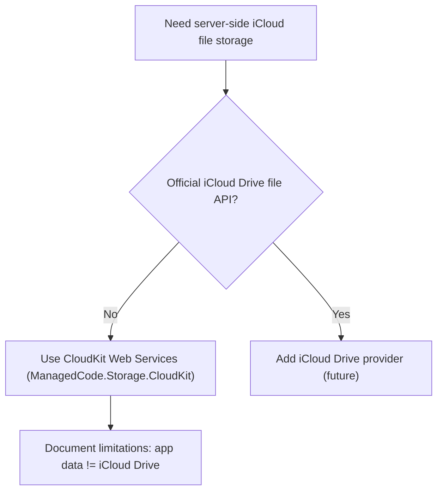

# ADR 0001: iCloud Drive Support vs CloudKit (Server-side)

## Status

Accepted — 2025-12-14

## Context

This repository provides a provider-agnostic `IStorage` abstraction for server-side and cross-platform .NET apps.

We want an “Apple cloud storage” option that behaves like other providers (upload/download/list/delete/metadata) and can run:

- in server environments (Linux containers, CI) and
- without requiring Apple-only runtime APIs.

The user request is “iCloud” as a storage backend, ideally for file-like storage similar to OneDrive/Google Drive/Dropbox.

## Problem

Apple’s “iCloud Drive” is primarily exposed to Apple platform apps via OS-level document APIs and does **not** have a stable, public, server-side file API comparable to:

- Microsoft Graph (OneDrive),
- Google Drive REST API, or
- Dropbox HTTP API.

There are unofficial approaches (reverse-engineered iCloud.com traffic) but they:

- are brittle and can break without notice,
- often require Apple ID + 2FA/session cookies (high operational/security risk),
- are not ideal for a general-purpose OSS storage provider.

## Decision

We will **not** implement an `iCloud Drive` provider in this repository unless Apple publishes and supports a proper server-side file API.

Instead, we support **CloudKit Web Services** via `ManagedCode.Storage.CloudKit`, which is an official Apple service intended for app data stored in iCloud.

CloudKit is not “iCloud Drive”, but it is the closest official server-side storage surface Apple exposes for app data.

## Consequences

### Positive

- Keeps the storage layer stable and supportable (no reverse-engineered contracts).
- Avoids unsafe auth patterns (Apple ID passwords, session scraping).
- Works in CI and server environments.

### Negative

- Users who explicitly need iCloud Drive (document storage visible in Finder/iOS Files) cannot use this library for that use-case.
- CloudKit has quotas and record/asset constraints that differ from “drive” providers.

## Alternatives Considered

1. **Unofficial iCloud Drive API wrappers**
   - Rejected due to brittleness, auth complexity (2FA), and reliability/security risks.
2. **Apple platform-only implementation**
   - Would not satisfy server-side scenarios and would complicate the provider model.

## References (Internal)

- `docs/Development/credentials.md` (CloudKit auth + setup)
- `docs/Features/provider-cloudkit.md`
- `README.md` (CloudKit section + explicit “not iCloud Drive” note)
