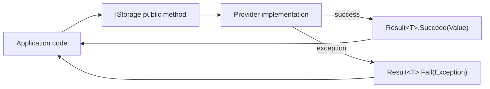

# ADR 0002: Standardize on `Result` / `Result<T>` for Public APIs

## Status

Accepted — 2025-12-15

## Context

`ManagedCode.Storage` targets multiple providers and integration surfaces (core abstractions, ASP.NET controllers, SignalR, client SDKs).

Providers and vendor SDKs typically expose errors via:

- thrown exceptions (often provider-specific types), and/or
- HTTP error payloads with inconsistent shapes.

We want consumers to handle failures consistently without needing to know each provider’s exception taxonomy.

## Problem

If we let exceptions flow through public APIs, we end up with:

- inconsistent error handling across providers,
- scattered try/catch logic in app code,
- harder mapping to HTTP/SignalR responses (especially for “expected” failures like 404 / not found),
- more brittle tests (asserting on exception types/messages instead of observable behaviour).

## Decision

All public storage operations return `ManagedCode.Communication.Result` / `Result<T>`:

- `Result.IsSuccess` indicates success/failure.
- On failure we return `Result.Fail(exception)` (or `Result<T>.Fail(exception)`), preserving the root exception.
- Providers still throw for **misconfiguration** (e.g., missing credentials) where the system cannot function.

This yields predictable, provider-agnostic semantics for callers and for integration layers (controllers/hubs/clients).

## Alternatives Considered

1. **Throw exceptions from public APIs**
   - Pros: “idiomatic” in many .NET libraries; no wrapper allocation.
   - Cons: inconsistent exceptions across providers; hard to map to HTTP; brittle tests.
2. **Return `bool`/`Try*` patterns**
   - Pros: simple for some operations.
   - Cons: does not carry rich error context; awkward for non-boolean results.
3. **Custom discriminated union / error codes**
   - Pros: could provide stable error taxonomy.
   - Cons: larger surface area; more maintenance; still needs exception preservation for diagnostics.

## Consequences

### Positive

- One error model across all providers and integrations.
- Easier translation to HTTP/SignalR responses (status codes + payloads).
- Tests assert on behaviour (`IsSuccess`, returned values) instead of exception types.

### Negative

- Callers must consistently check `IsSuccess` and handle failures.
- Providers implement some boilerplate `try/catch` to convert exceptions to results.

## References (Internal)

- `ManagedCode.Storage.Core/IStorage.cs`
- `ManagedCode.Storage.Core/BaseStorage.cs`
- `Storages/ManagedCode.Storage.Dropbox/DropboxStorage.cs` (example provider error handling)
- `Tests/ManagedCode.Storage.Tests/Core/StorageClientChunkTests.cs`
