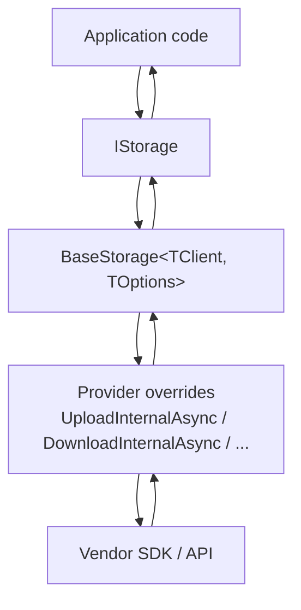

# ADR 0003: Implement Providers via `BaseStorage<TClient, TOptions>` (Template Method)

## Status

Accepted — 2025-12-15

## Context

Providers share the same high-level capabilities (upload/download/streaming, metadata, deletion, and container lifecycle), and we want these behaviours to be consistent across all implementations.

- upload/download (including stream-based),
- delete/exists/list/metadata,
- common option handling (`UploadOptions`, `DownloadOptions`, …),
- cross-cutting defaults (paths, MIME defaults),
- container lifecycle (`CreateContainerAsync`) where it exists.

Duplicating this logic in every provider increases drift and makes behaviour inconsistent.

## Problem

Without a shared provider base:

- each provider re-implements option wiring and defaults,
- bug fixes must be repeated across providers,
- subtle differences emerge (e.g., MIME defaults, path normalization, stream disposal).

## Decision

Provider implementations inherit `BaseStorage<TClient, TOptions>`:

- `BaseStorage` implements public `IStorage` methods and applies shared behaviour (options, MIME defaults, common helpers).
- Providers implement the provider-specific “internal” methods (`UploadInternalAsync`, `DownloadInternalAsync`, etc.).
- The storage client (`TClient`) is created once by `CreateStorageClient()` and exposed as `StorageClient`.

## Alternatives Considered

1. **Implement `IStorage` fully per provider**
   - Pros: no inheritance; explicit implementation.
   - Cons: large duplication; inconsistent behaviour across providers.
2. **Composition-based helper services**
   - Pros: avoids inheritance and virtual calls in constructors.
   - Cons: more moving pieces; harder for contributors to implement new providers quickly.
3. **Source generators / partial templates**
   - Pros: could reduce boilerplate further.
   - Cons: complexity and tooling overhead.

## Consequences

### Positive

- Consistent semantics across providers (options, MIME defaults, common patterns).
- Providers focus on SDK/API specifics.
- Shared fixes are applied once in the base class.

### Negative

- A virtual method (`CreateStorageClient`) is called from the base constructor; providers must keep it simple and avoid using uninitialized derived state.
- Base class changes must be done carefully to avoid breaking all providers.

## References (Internal)

- `ManagedCode.Storage.Core/BaseStorage.cs`
- `ManagedCode.Storage.Core/IStorage.cs`
- Example providers:
  - `Storages/ManagedCode.Storage.Azure/AzureStorage.cs`
  - `Storages/ManagedCode.Storage.Aws/AwsStorage.cs`
  - `Storages/ManagedCode.Storage.Dropbox/DropboxStorage.cs`
