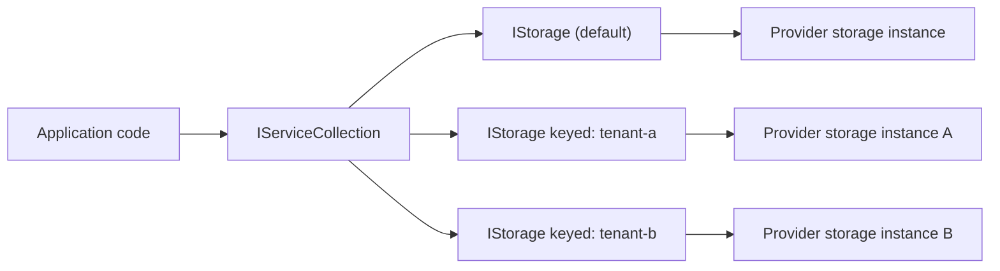

# ADR 0004: Use Keyed DI + `Add*Storage...` Extensions for Multi-Storage Wiring

## Status

Accepted — 2025-12-15

## Context

Consumers frequently need both a single “default” `IStorage` and multiple storages side-by-side (multi-tenant, multi-region, mirroring, per-workload routing).

- one “default” `IStorage`, and/or
- multiple storages side-by-side (multi-tenant, multi-region, mirroring, per-workload routing).

.NET provides **keyed services** as a first-party DI mechanism for resolving multiple instances by key.

## Problem

If we only support a single `IStorage` registration:

- multi-tenant apps must build their own factories and option stores,
- tests and samples become fragmented,
- providers end up with inconsistent registration patterns.

## Decision

We standardize registration on:

1. **Provider-specific extension methods**:
   - `Add{Provider}StorageAsDefault(...)` for default `IStorage`
   - `Add{Provider}Storage(key, ...)` (and equivalents) for keyed registrations
2. **Keyed services for multi-storage**:
   - `AddKeyedSingleton<T>(key, factory)`
   - resolve via `GetRequiredKeyedService<T>(key)` (or `[FromKeyedServices("key")]` in ASP.NET)
3. **A provider factory abstraction** for dynamic creation:
   - `IStorageProvider` (per provider)
   - `IStorageFactory` (resolves provider by options type)

## Alternatives Considered

1. **Custom `IStorageFactory` only**
   - Pros: one abstraction to learn.
   - Cons: consumers still need to implement keying/tenant routing; DI usage becomes less idiomatic.
2. **Named options + a dictionary of storages**
   - Pros: works in older .NET versions.
   - Cons: more boilerplate; higher risk of inconsistent patterns.
3. **Keyed DI (chosen)**
   - Pros: first-party DI feature; integrates with ASP.NET; aligns with multi-tenant patterns.
   - Cons: requires modern .NET; keys must be coordinated and documented.

## Consequences

### Positive

- Default and multi-storage setups are consistent across providers.
- Consumers can scale registrations without building custom plumbing.
- Tests can validate DI wiring in a provider-agnostic way.

### Negative

- Keyed DI requires careful documentation (keys, lifetimes, and how to resolve).
- Some scenarios still require an explicit routing layer (e.g., resolving keys per request/tenant).

## References (Internal)

- `docs/Features/dependency-injection.md`
- `ManagedCode.Storage.Core/Providers/IStorageProvider.cs`
- `ManagedCode.Storage.Core/Providers/StorageFactory.cs`
- Example registrations:
  - `Storages/ManagedCode.Storage.Dropbox/Extensions/ServiceCollectionExtensions.cs`
  - `Storages/ManagedCode.Storage.GoogleDrive/Extensions/ServiceCollectionExtensions.cs`
  - `Storages/ManagedCode.Storage.OneDrive/Extensions/ServiceCollectionExtensions.cs`
- Tests:
  - `Tests/ManagedCode.Storage.Tests/Storages/CloudDrive/CloudDriveDependencyInjectionTests.cs`
