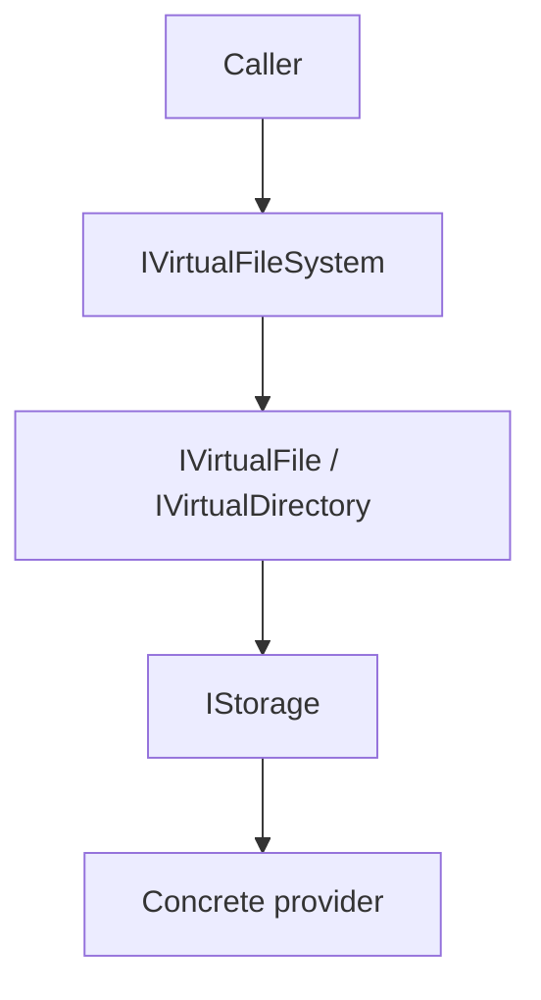

# ADR 0005: Implement a VFS Overlay (`IVirtualFileSystem`) on Top of `IStorage`

## Status

Accepted — 2025-12-15

## Context

Most object-storage providers do not have “real directories”; they have key prefixes, but many apps still need a file/directory API that works consistently on top of any configured `IStorage`.

- file-like APIs (open read/write streams, read/write text),
- directory-like APIs (list, delete recursively),
- caching and convenience behaviours that should work across providers.

## Problem

If we extend `IStorage` with a full directory/file API:

- the core abstraction becomes heavier and less provider-agnostic,
- providers with limited listing semantics may behave inconsistently,
- we risk breaking existing consumers when adding higher-level behaviours.

## Decision

We keep `IStorage` as the provider-agnostic blob abstraction and implement a separate overlay package:

- `ManagedCode.Storage.VirtualFileSystem` exposes `IVirtualFileSystem`, `IVirtualFile`, and `IVirtualDirectory`.
- Directory operations are implemented via prefix listing using `IStorage.GetBlobMetadataListAsync(...)`.
- Optional caching (e.g., metadata/existence) is configured via `VfsOptions`.

## Alternatives Considered

1. **Add directory/file methods to `IStorage`**
   - Pros: one API for everything.
   - Cons: bloats core; forces all providers to model higher-level semantics.
2. **Provider-specific directory APIs**
   - Pros: can be “native” where the provider supports it.
   - Cons: inconsistent across providers; consumers lose portability.
3. **Overlay VFS (chosen)**
   - Pros: portable; optional; keeps core small.
   - Cons: directory semantics rely on listing/prefix conventions and may be slower without caching.

## Consequences

### Positive

- Works on top of any configured `IStorage`.
- Keeps core provider abstraction stable and minimal.
- Enables caching and higher-level conveniences without forcing provider changes.

### Negative

- Directory semantics are “virtual” and depend on listing support and naming conventions.
- Some operations (e.g., recursive deletes) can be expensive for very large prefixes.

## References (Internal)

- `docs/Features/virtual-file-system.md`
- `ManagedCode.Storage.VirtualFileSystem/Implementations/VirtualFileSystem.cs`
- `ManagedCode.Storage.VirtualFileSystem/Implementations/VirtualDirectory.cs`
- Tests:
  - `Tests/ManagedCode.Storage.Tests/VirtualFileSystem/VirtualFileSystemTests.cs`
  - `Tests/ManagedCode.Storage.Tests/VirtualFileSystem/Fixtures/*VirtualFileSystemFixture.cs`
