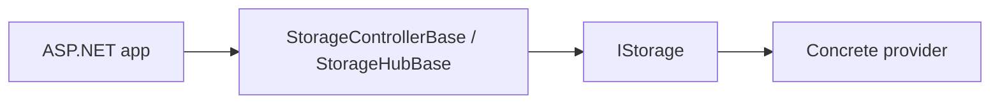

# ADR 0006: “Base-First” ASP.NET Controllers/Hubs with Minimal Routing Defaults

## Status

Accepted — 2025-12-15

## Context

ManagedCode.Storage aims to provide end-to-end HTTP and SignalR flows on top of `IStorage`, while still allowing host applications to fully control routing and authorization.

- HTTP upload/download (including streaming),
- chunked uploads for large files,
- SignalR streaming + progress reporting.

However, consumers often need to customize:

- routing (prefixes, versions),
- authorization and policies,
- headers/response formats,
- hosting constraints (reverse proxies, rate limits).

## Problem

If the library ships only “final” controllers with fixed routes and behaviour:

- consumers must fork or wrap endpoints to customize,
- behaviour becomes rigid and harder to integrate into existing APIs,
- auth and routing changes become breaking changes.

## Decision

We ship a “base-first” server integration:

- `StorageControllerBase` and `StorageHubBase` provide the core implementation.
- Consumers can inherit and customize routes/auth while reusing the logic.
- The package also includes default concrete implementations (`StorageController`, `StorageHub`) for quickstarts.
- Endpoint mapping is provided via extension methods (`MapControllers`, `MapStorageHub`, etc.).

## Alternatives Considered

1. **Fixed controllers only**
   - Pros: simplest surface; minimal classes.
   - Cons: poor customizability; forces consumers into a specific routing/auth model.
2. **Minimal API only**
   - Pros: flexible; composable.
   - Cons: harder to ship a stable SDK surface; more code in consumer apps.
3. **Base-first controllers/hubs (chosen)**
   - Pros: reusable logic + flexible customization; stable upgrade story.
   - Cons: more types; requires docs/examples so consumers understand inheritance points.

## Consequences

### Positive

- Consumers can customize routing/auth without forking library code.
- Backwards compatibility is easier: base logic can evolve while derived controllers stay stable.
- Supports both quickstart defaults and deep customization.

### Negative

- Requires clear documentation and examples (inheritance + endpoint mapping).
- More surface area to maintain (base + default derived types).

## References (Internal)

- `docs/Features/integration-aspnet-server.md`
- `Integraions/ManagedCode.Storage.Server/Controllers/StorageControllerBase.cs`
- `Integraions/ManagedCode.Storage.Server/Hubs/StorageHubBase.cs`
- `Integraions/ManagedCode.Storage.Server/Extensions/StorageEndpointRouteBuilderExtensions.cs`
- Tests:
  - `Tests/ManagedCode.Storage.Tests/AspNetTests/*`
