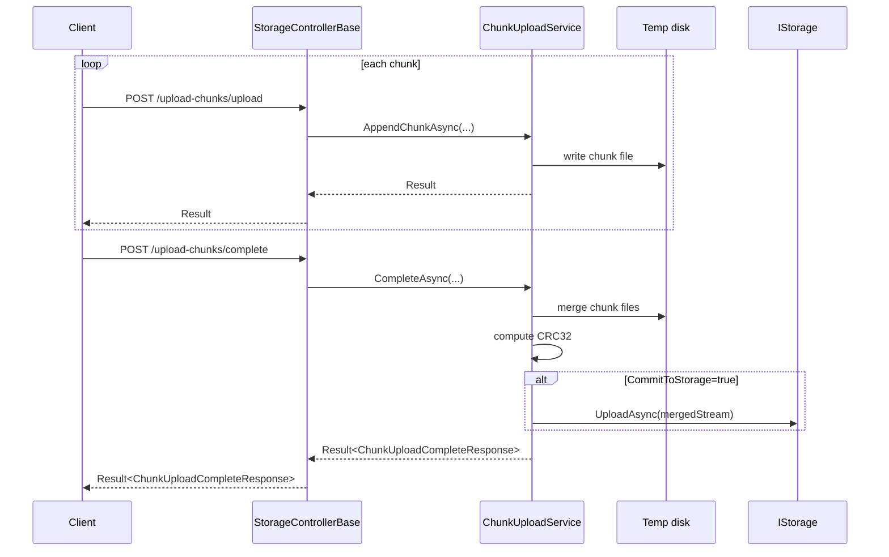

# ADR 0007: Chunked Uploads Stage to Disk and Validate with CRC32

## Status

Accepted — 2025-12-15

## Context

Large file uploads over HTTP are inherently unreliable (mobile networks, proxy timeouts, client disconnects).
We want resumable uploads that:

- are provider-agnostic (work regardless of the configured `IStorage`),
- support integrity validation,
- do not require loading the entire file in memory on the server.

## Problem

Provider-native multipart/resumable uploads exist (S3 multipart, Azure block blobs, etc.), but:

- each provider has different APIs and edge cases,
- it complicates the “single abstraction” goal,
- it is harder to expose a single, stable HTTP API.

## Decision

We implement chunked uploads as a server-side orchestration feature:

- Each chunk is uploaded and staged to disk via `ChunkUploadService`.
- Completion merges chunks in order into a single stream/file.
- The merged content is validated using CRC32.
- Optionally, the merged stream is committed to the configured `IStorage` (`CommitToStorage=true`).

## Alternatives Considered

1. **Provider-native multipart/resumable APIs**
   - Pros: no server staging; potentially faster.
   - Cons: provider-specific; complicates a unified HTTP API; more edge cases.
2. **Stage chunks in memory**
   - Pros: simpler IO; fewer disk concerns.
   - Cons: unsafe for large files; memory pressure in server environments.
3. **Stage to disk (chosen)**
   - Pros: provider-agnostic; supports very large files; stable semantics.
   - Cons: requires disk space and cleanup; disk IO overhead.

## Consequences

### Positive

- Works for any configured `IStorage`.
- Resumable uploads and integrity validation are consistent across providers.
- Avoids large in-memory buffering on the server.

### Negative

- Requires server disk storage and cleanup policies for incomplete sessions.
- Large uploads can increase disk IO and require capacity planning.

## References (Internal)

- `docs/Features/chunked-uploads.md`
- `Integraions/ManagedCode.Storage.Server/ChunkUpload/ChunkUploadService.cs`
- `ManagedCode.Storage.Core/Helpers/Crc32Helper.cs`
- Tests:
  - `Tests/ManagedCode.Storage.Tests/Server/ChunkUploadServiceTests.cs`
  - `Tests/ManagedCode.Storage.Tests/Core/StorageClientChunkTests.cs`
