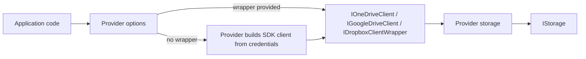

# ADR 0008: Cloud Drive Providers Use SDK Client Wrappers + Options-Based Auth

## Status

Accepted — 2025-12-15

## Context

Cloud drive providers (OneDrive/Google Drive/Dropbox) are API-first systems that require OAuth token management and typically ship vendor SDKs with their own abstractions.

- OAuth flows and token management,
- vendor SDKs (or direct HTTP),
- careful testability without using real cloud accounts in CI.

We also want consumers to have a clear “swap point” for advanced scenarios and for tests.

## Problem

If providers accept only raw vendor SDK clients:

- consumers must build the client correctly (auth, middleware, base URLs),
- tests tend to mock SDK methods (brittle and not behaviour-driven),
- SDK evolution leaks into public API contracts.

If we re-implement all REST calls ourselves:

- we effectively become an SDK, with a large maintenance burden.

## Decision

For cloud-drive providers we standardize on:

1. **Small wrapper interfaces** used by the storage implementation:
   - OneDrive: `IOneDriveClient`
   - Google Drive: `IGoogleDriveClient`
   - Dropbox: `IDropboxClientWrapper`
2. **Options allow multiple configuration styles**:
   - Provide the wrapper directly (`options.Client = ...`) for full control.
   - Provide a raw SDK client (`options.DropboxClient = ...`) where supported.
   - Provide credentials/tokens so the provider can construct the SDK client when no client is supplied.

This keeps provider logic:

- aligned with the official SDK contract,
- testable via HTTP fakes (see ADR 0009),
- easy to consume for the common case (credentials in options).

## Alternatives Considered

1. **Expose only raw SDK clients**
   - Pros: minimal wrapper code in the library.
   - Cons: weak testability; pushes complexity into consumer apps; SDK contract leaks.
2. **Call REST directly (no SDK)**
   - Pros: full control; easy to inject `HttpClient`.
   - Cons: large maintenance burden; re-implementing vendor SDK behaviour.
3. **SDK wrapper interfaces + options-based auth (chosen)**
   - Pros: stable swap point; behaviour-driven HTTP tests; reasonable consumer experience.
   - Cons: wrapper maintenance; requires good credential docs for each provider.

## Consequences

### Positive

- Minimal consumer boilerplate (options can build clients when possible).
- Clean test seams: fake HTTP through official SDK plumbing without mocking SDK methods.
- Providers can evolve without exposing vendor SDK types everywhere.

### Negative

- Wrapper interfaces and adapters must be maintained.
- Credential acquisition must be documented clearly per provider.

## References (Internal)

- `docs/Features/dependency-injection.md` (swap points section)
- Provider options and clients:
  - `Storages/ManagedCode.Storage.OneDrive/Options/OneDriveStorageOptions.cs`
  - `Storages/ManagedCode.Storage.GoogleDrive/Options/GoogleDriveStorageOptions.cs`
  - `Storages/ManagedCode.Storage.Dropbox/Options/DropboxStorageOptions.cs`
  - `Storages/ManagedCode.Storage.Dropbox/Clients/DropboxClientWrapper.cs`
- Tests:
  - `Tests/ManagedCode.Storage.Tests/Storages/CloudDrive/GraphOneDriveClientTests.cs`
  - `Tests/ManagedCode.Storage.Tests/Storages/CloudDrive/GoogleDriveClientHttpTests.cs`
  - `Tests/ManagedCode.Storage.Tests/Storages/CloudDrive/DropboxClientWrapperHttpTests.cs`
