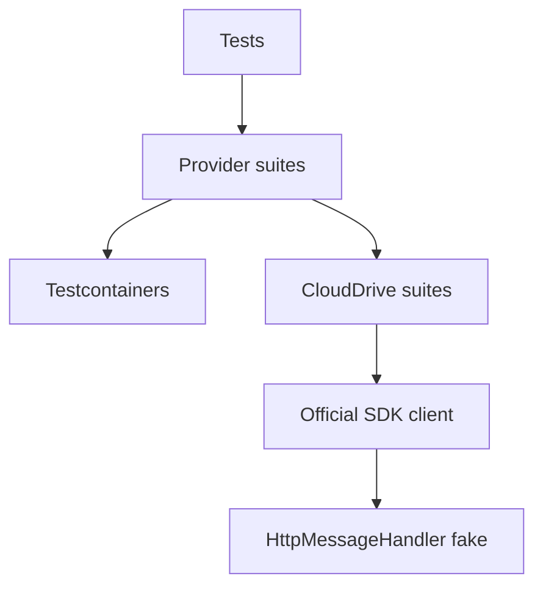

# ADR 0009: Integration-First Testing with Testcontainers + `HttpMessageHandler` Fakes

## Status

Accepted — 2025-12-15

## Context

This repository targets many providers and wants high-confidence coverage in CI and locally without requiring real cloud accounts or fragile SDK mocks.

- real cloud accounts/keys in CI,
- heavy mocking of SDK internals,
- fragile tests that only validate mocked interactions.

## Problem

1. For “infrastructure-style” providers (Azure/AWS/GCS/SFTP), pure unit tests provide low confidence because behaviour depends on real protocol semantics.
2. For cloud-drive APIs (Graph/Drive/Dropbox), running against real services is expensive and requires secrets, while mocking SDK methods is brittle.

## Decision

We standardize on an integration-first test strategy:

- Use **Testcontainers** for providers that can run locally:
  - Azurite (Azure Blob)
  - LocalStack (AWS S3)
  - FakeGcsServer (Google Cloud Storage)
  - SFTP container
- For cloud-drive providers, use `HttpMessageHandler`-based fakes wired into the **official SDK clients** to simulate:
  - endpoints,
  - status codes,
  - error payload shapes,
  - pagination behaviour where needed.

## Alternatives Considered

1. **Mock provider/SDK methods**
   - Pros: easy to write.
   - Cons: tests validate mocks, not behaviour; fragile over time.
2. **Use real cloud accounts**
   - Pros: highest fidelity.
   - Cons: secrets management; cost; flakiness; hard to run locally.
3. **Containers + HTTP fakes (chosen)**
   - Pros: high fidelity without secrets; reproducible locally and in CI.
   - Cons: requires Docker for container suites; HTTP fakes must track API docs.

## Consequences

### Positive

- Strong confidence for core flows (upload/download/list/delete/metadata/streaming).
- Minimal mocking; tests assert concrete behaviour.
- CI does not require cloud secrets for most suites.

### Negative

- Some suites require Docker (containers) and may be slower than unit tests.
- Cloud-drive HTTP fakes must be kept aligned with API docs and SDK expectations.

## References (Internal)

- `docs/Testing/strategy.md`
- Container usage:
  - `Tests/ManagedCode.Storage.Tests/Common/StorageTestApplication.cs`
  - `Tests/ManagedCode.Storage.Tests/Storages/Azure/*`
  - `Tests/ManagedCode.Storage.Tests/Storages/AWS/*`
  - `Tests/ManagedCode.Storage.Tests/Storages/GCS/*`
  - `Tests/ManagedCode.Storage.Tests/Storages/Sftp/*`
- CloudDrive HTTP fakes:
  - `Tests/ManagedCode.Storage.Tests/Storages/CloudDrive/GraphOneDriveClientTests.cs`
  - `Tests/ManagedCode.Storage.Tests/Storages/CloudDrive/GoogleDriveClientHttpTests.cs`
  - `Tests/ManagedCode.Storage.Tests/Storages/CloudDrive/DropboxClientWrapperHttpTests.cs`
