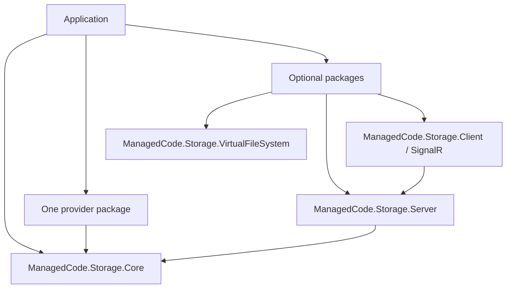

# ADR 0012: Modular Packaging (Core + Providers + Integrations)

## Status

Accepted — 2025-12-15

## Context

ManagedCode.Storage supports many storage backends (Azure/AWS/GCP/SFTP/Cloud drives/CloudKit) and multiple integration surfaces (ASP.NET server, clients, VFS).

Most consumers only need:

- the core abstraction (`IStorage`), and
- one (or a few) provider(s).

## Problem

A monolithic “one package includes everything” approach would:

- pull large vendor SDK dependency graphs into every consumer,
- increase build time and runtime footprint,
- raise the risk of dependency conflicts,
- make it harder to reason about what a given app actually uses.

## Decision

We keep the repository modular and ship multiple NuGet packages:

- **Core abstractions** live in `ManagedCode.Storage.Core/`.
- **Providers** live under `Storages/ManagedCode.Storage.*` (one project per provider).
- **Integrations** live under `Integraions/` (ASP.NET server + client SDKs).
- **VFS overlay** lives in `ManagedCode.Storage.VirtualFileSystem/`.
- **Test doubles** live in `ManagedCode.Storage.TestFakes/`.
- **Test suites** live in `Tests/ManagedCode.Storage.Tests/`.

This structure lets consumers reference only what they need, while still enabling consistent evolution and cross-provider test coverage.

## Alternatives Considered

1. **Single monolithic package**
   - Pros: simplest installation story.
   - Cons: heavy dependencies; poor modularity; more conflicts.
2. **Dynamic plugin loading**
   - Pros: can load providers at runtime.
   - Cons: complexity, reflection/loading concerns, harder trimming/AOT story.
3. **Multiple packages (chosen)**
   - Pros: modular; consumers pull only needed SDKs; clearer ownership boundaries.
   - Cons: more packages/docs to maintain; requires good README guidance.

## Consequences

### Positive

- Smaller dependency footprint for consumers.
- Provider SDK dependencies are isolated per provider package.
- Easier to maintain and test providers independently.

### Negative

- Users must understand which packages to install for their providers/integrations.
- Docs must clearly show package selection and DI wiring.

## References (Internal)

- `ManagedCode.Storage.slnx`
- `README.md` (Packages section)
- `docs/Features/index.md`
