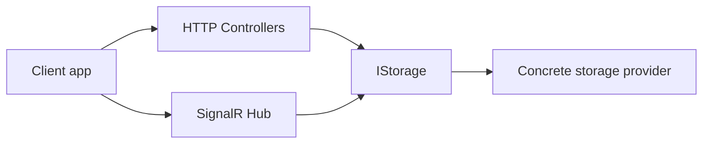

# API

ManagedCode.Storage exposes an HTTP + SignalR integration surface via `ManagedCode.Storage.Server`.

```mermaid
flowchart LR
  App[Client app] --> Http[HTTP Controllers]
  App --> Hub[SignalR Hub]
  Http --> Storage[IStorage]
  Hub --> Storage
  Storage --> Provider[Concrete storage provider]
```

- [Storage server (HTTP + SignalR)](storage-server.md)
