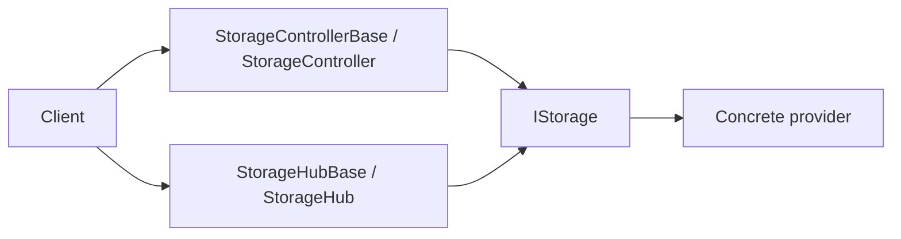
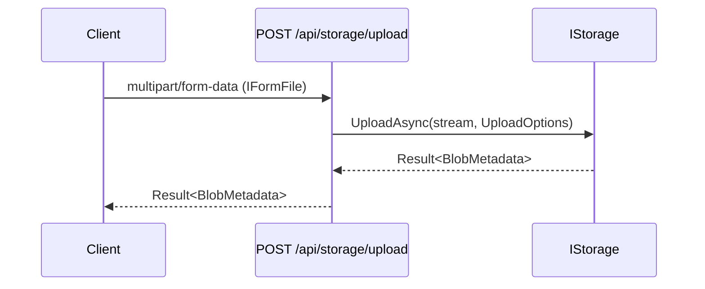
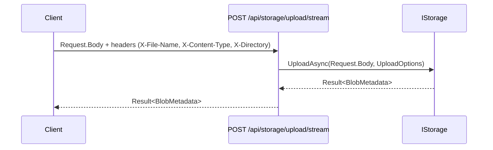
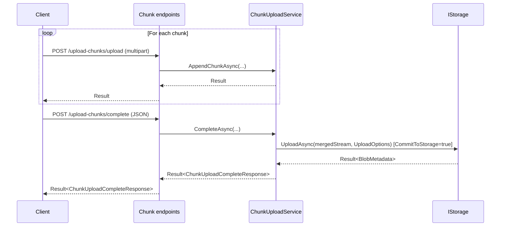
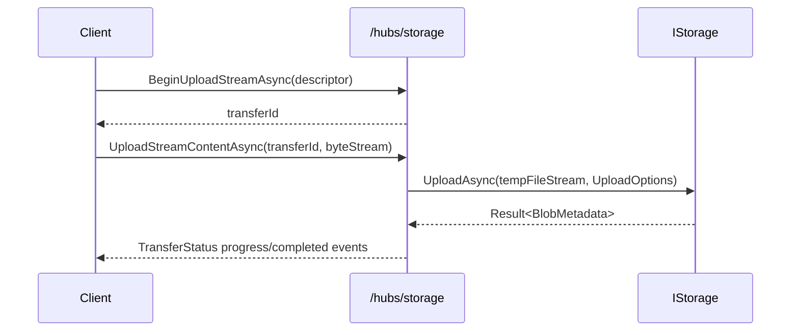

# API: Storage Server (HTTP + SignalR)

This document describes the integration surface exposed by `Integraions/ManagedCode.Storage.Server`.

## Request Flow

## HTTP API

Default controller: `Integraions/ManagedCode.Storage.Server/Controllers/StorageController.cs`

Base route:

- `/api/storage`

### Upload (multipart)

- `POST /api/storage/upload`
- Request: `multipart/form-data` with a single `IFormFile` field named `file`
- Response: `Result<BlobMetadata>`

Notes:

- If `StorageServerOptions.EnableFileSizeValidation` is enabled, the controller enforces `MaxFileSize`.

### Upload (stream)

- `POST /api/storage/upload/stream`
- Request: raw body stream (`Request.Body`)
- Required headers:
  - `X-File-Name`
- Optional headers:
  - `X-Content-Type`
  - `X-Directory`
- Response: `Result<BlobMetadata>`

### Download (file response)

- `GET /api/storage/download/{*path}`
- Response: `FileStreamResult` (`Content-Type` resolved via `MimeHelper`)
- Range requests:
  - enabled when `StorageServerOptions.EnableRangeProcessing = true`

### Stream (inline)

- `GET /api/storage/stream/{*path}`
- Response: `FileStreamResult` without a `fileDownloadName` (useful for inline streaming)
- Range requests:
  - enabled when `StorageServerOptions.EnableRangeProcessing = true`

### Download as bytes

- `GET /api/storage/download-bytes/{*path}`
- Response: `File(byte[])`

### Chunked upload

Chunk payload model: `Integraions/ManagedCode.Storage.Server/Models/FileUploadPayload.cs`

- `POST /api/storage/upload-chunks/upload`
  - Request: `multipart/form-data`
  - Response: `Result`
- `POST /api/storage/upload-chunks/complete`
  - Request: JSON (`ChunkUploadCompleteRequest`)
  - Response: `Result<ChunkUploadCompleteResponse>`
- `DELETE /api/storage/upload-chunks/{uploadId}`
  - Response: `204 No Content`

## SignalR Hub API

Default hub:

- `Integraions/ManagedCode.Storage.Server/Hubs/StorageHub.cs`
- Default route mapping: `Integraions/ManagedCode.Storage.Server/Extensions/StorageEndpointRouteBuilderExtensions.cs`
  - `/hubs/storage`

Key hub methods (base implementation in `StorageHubBase<TStorage>`):

- `Task<string> BeginUploadStreamAsync(UploadStreamDescriptor descriptor)`
- `IAsyncEnumerable<TransferStatus> UploadStreamContentAsync(string transferId, IAsyncEnumerable<byte[]> stream, CancellationToken ct)`
- `IAsyncEnumerable<byte[]> DownloadStreamAsync(string blobName, CancellationToken ct)`
- `Task<TransferStatus?> GetStatusAsync(string transferId)`
- `Task CancelTransferAsync(string transferId)`

Progress events emitted to the caller:

- `TransferProgress`
- `TransferCompleted`
- `TransferCanceled`
- `TransferFaulted`

Event names are defined in `Integraions/ManagedCode.Storage.Server/Hubs/StorageHubBase.cs` (`StorageHubEvents`).

