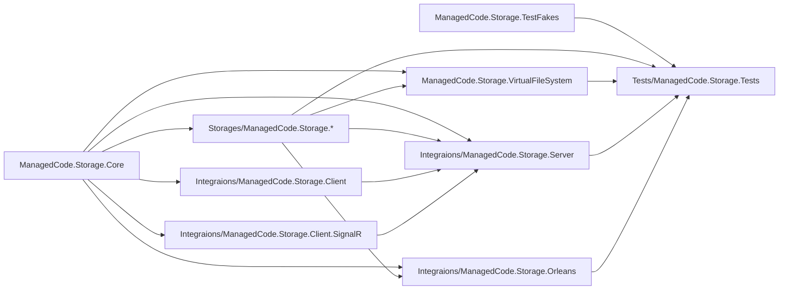
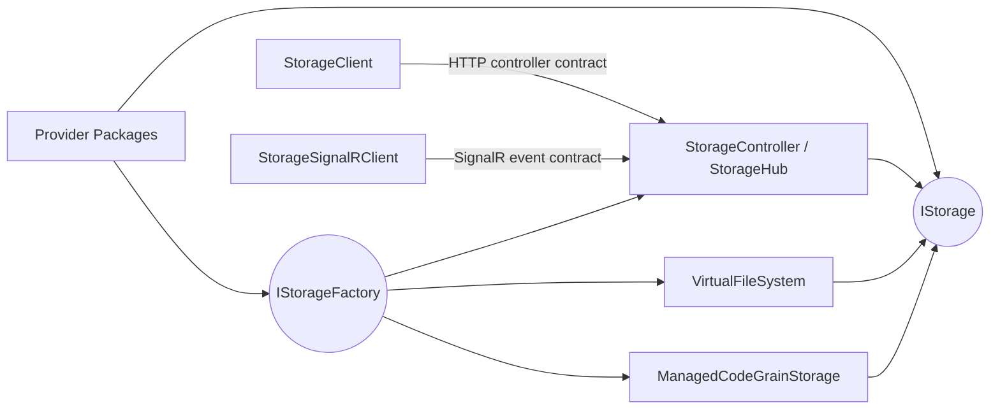
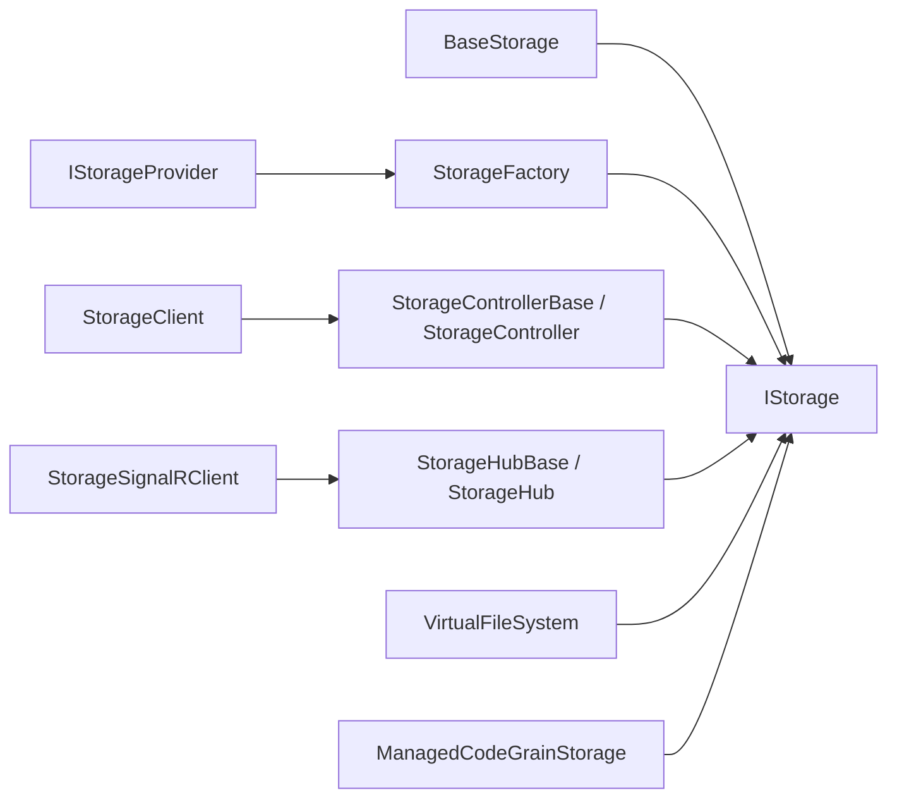

# Architecture Overview

Goal: in ~5 minutes, understand what exists, where it lives, and how the storage modules interact.

This file is the primary start-here card for humans and AI agents.

Single source of truth: keep this doc navigational and coarse. Detailed behavior belongs in `docs/Features/*`; detailed decisions and invariants belong in `docs/ADR/*`.

## Summary

- **System:** ManagedCode.Storage is a .NET 10 storage platform with shared abstractions, provider packages, a virtual file system, ASP.NET delivery layers, client SDKs, Orleans grain persistence, browser storage with IndexedDB metadata and OPFS payloads, and end-to-end integration tests.
- **Where is the code:** core contracts in `ManagedCode.Storage.Core/`, providers in `Storages/`, transport and integration packages in `Integraions/`, VFS in `ManagedCode.Storage.VirtualFileSystem/`, end-to-end coverage in `Tests/ManagedCode.Storage.Tests/`, and browser-e2e verification in `Tests/ManagedCode.Storage.BrowserServerHost/` plus `Tests/ManagedCode.Storage.BrowserWasmHost/`.
- **Entry points:** DI extension methods, `IStorage` and `IStorageFactory`, ASP.NET controllers and hubs, HTTP and SignalR clients, Orleans `IGrainStorage`, and the xUnit test suite.
- **Dependencies:** providers implement the Core contracts; VFS and integrations consume `IStorage` or `IStorageFactory`; tests compose the real packages plus `ManagedCode.Storage.TestFakes/`.

## Scoping (read first)

- **In scope:** storage abstractions, provider DI registration, transport integrations, VFS behavior, Orleans persistence wiring, and the test harnesses that prove those flows.
- **Out of scope:** external cloud-account provisioning, consumer application code outside the published integrations, and vendor SDK internals beyond the wrapper boundaries in provider projects.
- Pick impacted module(s) from the diagrams and navigation index below.
- Pick entry point(s): DI extension, provider implementation, HTTP controller, SignalR hub, VFS surface, Orleans adapter, or test harness.
- Read only the linked docs plus the specific entry-point files for the change.

## 2) Diagrams (Mermaid)

### 2.1 System / module map

### 2.2 Interfaces / contracts map

### 2.3 Key classes / types map

## 3) Navigation Index

### 3.1 Modules

- `ManagedCode.Storage.Core` — code: [../ManagedCode.Storage.Core/](../ManagedCode.Storage.Core/); entry points: [../ManagedCode.Storage.Core/IStorage.cs](../ManagedCode.Storage.Core/IStorage.cs), [../ManagedCode.Storage.Core/Extensions/ServiceCollectionExtensions.cs](../ManagedCode.Storage.Core/Extensions/ServiceCollectionExtensions.cs); docs: [./README.md](../README.md), [./Development/setup.md](./Development/setup.md)
- `Storages/ManagedCode.Storage.*` — code: [../Storages/](../Storages/); entry points: provider `Extensions/ServiceCollectionExtensions.cs` files such as [../Storages/ManagedCode.Storage.Azure/Extensions/ServiceCollectionExtensions.cs](../Storages/ManagedCode.Storage.Azure/Extensions/ServiceCollectionExtensions.cs) and [../Storages/ManagedCode.Storage.FileSystem/Extensions/ServiceCollectionExtensions.cs](../Storages/ManagedCode.Storage.FileSystem/Extensions/ServiceCollectionExtensions.cs); docs: [./Features/index.md](./Features/index.md), [./README.md](../README.md)
- `Storages/ManagedCode.Storage.Browser` — code: [../Storages/ManagedCode.Storage.Browser/](../Storages/ManagedCode.Storage.Browser/); entry points: [../Storages/ManagedCode.Storage.Browser/BrowserStorage.cs](../Storages/ManagedCode.Storage.Browser/BrowserStorage.cs), [../Storages/ManagedCode.Storage.Browser/Extensions/ServiceCollectionExtensions.cs](../Storages/ManagedCode.Storage.Browser/Extensions/ServiceCollectionExtensions.cs), [../Storages/ManagedCode.Storage.Browser/Mvc/BrowserStorageStaticAssetPaths.cs](../Storages/ManagedCode.Storage.Browser/Mvc/BrowserStorageStaticAssetPaths.cs); docs: [./Features/provider-browser-storage.md](./Features/provider-browser-storage.md), [./README.md](../README.md)
- `ManagedCode.Storage.VirtualFileSystem` — code: [../ManagedCode.Storage.VirtualFileSystem/](../ManagedCode.Storage.VirtualFileSystem/); entry points: [../ManagedCode.Storage.VirtualFileSystem/Core/IVirtualFileSystem.cs](../ManagedCode.Storage.VirtualFileSystem/Core/IVirtualFileSystem.cs), [../ManagedCode.Storage.VirtualFileSystem/Extensions/ServiceCollectionExtensions.cs](../ManagedCode.Storage.VirtualFileSystem/Extensions/ServiceCollectionExtensions.cs); docs: [./Features/index.md](./Features/index.md)
- `Integraions/ManagedCode.Storage.Server` — code: [../Integraions/ManagedCode.Storage.Server/](../Integraions/ManagedCode.Storage.Server/); entry points: [../Integraions/ManagedCode.Storage.Server/Controllers/StorageControllerBase.cs](../Integraions/ManagedCode.Storage.Server/Controllers/StorageControllerBase.cs), [../Integraions/ManagedCode.Storage.Server/Hubs/StorageHub.cs](../Integraions/ManagedCode.Storage.Server/Hubs/StorageHub.cs), [../Integraions/ManagedCode.Storage.Server/Extensions/DependencyInjection/StorageServerBuilderExtensions.cs](../Integraions/ManagedCode.Storage.Server/Extensions/DependencyInjection/StorageServerBuilderExtensions.cs); docs: [./Features/index.md](./Features/index.md)
- `Integraions/ManagedCode.Storage.Client` — code: [../Integraions/ManagedCode.Storage.Client/](../Integraions/ManagedCode.Storage.Client/); entry points: [../Integraions/ManagedCode.Storage.Client/IStorageClient.cs](../Integraions/ManagedCode.Storage.Client/IStorageClient.cs), [../Integraions/ManagedCode.Storage.Client/StorageClient.cs](../Integraions/ManagedCode.Storage.Client/StorageClient.cs); docs: [./README.md](../README.md)
- `Integraions/ManagedCode.Storage.Client.SignalR` — code: [../Integraions/ManagedCode.Storage.Client.SignalR/](../Integraions/ManagedCode.Storage.Client.SignalR/); entry points: [../Integraions/ManagedCode.Storage.Client.SignalR/IStorageSignalRClient.cs](../Integraions/ManagedCode.Storage.Client.SignalR/IStorageSignalRClient.cs), [../Integraions/ManagedCode.Storage.Client.SignalR/StorageSignalRClient.cs](../Integraions/ManagedCode.Storage.Client.SignalR/StorageSignalRClient.cs); docs: [./README.md](../README.md)
- `Integraions/ManagedCode.Storage.Orleans` — code: [../Integraions/ManagedCode.Storage.Orleans/](../Integraions/ManagedCode.Storage.Orleans/); entry points: [../Integraions/ManagedCode.Storage.Orleans/Hosting/ManagedCodeStorageGrainStorageServiceCollectionExtensions.cs](../Integraions/ManagedCode.Storage.Orleans/Hosting/ManagedCodeStorageGrainStorageServiceCollectionExtensions.cs), [../Integraions/ManagedCode.Storage.Orleans/Storage/ManagedCodeGrainStorage.cs](../Integraions/ManagedCode.Storage.Orleans/Storage/ManagedCodeGrainStorage.cs); docs: [./Features/integration-orleans.md](./Features/integration-orleans.md)
- `ManagedCode.Storage.TestFakes` — code: [../ManagedCode.Storage.TestFakes/](../ManagedCode.Storage.TestFakes/); entry points: [../ManagedCode.Storage.TestFakes/FakeAzureStorage.cs](../ManagedCode.Storage.TestFakes/FakeAzureStorage.cs), [../ManagedCode.Storage.TestFakes/FakeGoogleStorage.cs](../ManagedCode.Storage.TestFakes/FakeGoogleStorage.cs); docs: [./Testing/index.md](./Testing/index.md)
- `Tests/ManagedCode.Storage.Tests` — code: [../Tests/ManagedCode.Storage.Tests/](../Tests/ManagedCode.Storage.Tests/); entry points: [../Tests/ManagedCode.Storage.Tests/Storages/](../Tests/ManagedCode.Storage.Tests/Storages/), [../Tests/ManagedCode.Storage.Tests/AspNetTests/](../Tests/ManagedCode.Storage.Tests/AspNetTests/), [../Tests/ManagedCode.Storage.Tests/VirtualFileSystem/](../Tests/ManagedCode.Storage.Tests/VirtualFileSystem/); docs: [./Testing/index.md](./Testing/index.md)
- `Tests/ManagedCode.Storage.BrowserServerHost` — code: [../Tests/ManagedCode.Storage.BrowserServerHost/](../Tests/ManagedCode.Storage.BrowserServerHost/); entry points: [../Tests/ManagedCode.Storage.BrowserServerHost/Program.cs](../Tests/ManagedCode.Storage.BrowserServerHost/Program.cs), [../Tests/ManagedCode.Storage.BrowserServerHost/Components/Pages/StoragePlayground.razor](../Tests/ManagedCode.Storage.BrowserServerHost/Components/Pages/StoragePlayground.razor); docs: [./Testing/index.md](./Testing/index.md)
- `Tests/ManagedCode.Storage.BrowserWasmHost` — code: [../Tests/ManagedCode.Storage.BrowserWasmHost/](../Tests/ManagedCode.Storage.BrowserWasmHost/); entry points: [../Tests/ManagedCode.Storage.BrowserWasmHost/Program.cs](../Tests/ManagedCode.Storage.BrowserWasmHost/Program.cs), [../Tests/ManagedCode.Storage.BrowserWasmHost/Pages/StoragePlayground.razor](../Tests/ManagedCode.Storage.BrowserWasmHost/Pages/StoragePlayground.razor); docs: [./Testing/index.md](./Testing/index.md)

### 3.2 Interfaces / contracts

- `IStorage` — source of truth: [../ManagedCode.Storage.Core/IStorage.cs](../ManagedCode.Storage.Core/IStorage.cs); producers: provider packages; consumers: VFS, server integrations, Orleans, and tests.
- `IStorageFactory` — source of truth: [../ManagedCode.Storage.Core/Providers/IStorageFactory.cs](../ManagedCode.Storage.Core/Providers/IStorageFactory.cs); producer: [../ManagedCode.Storage.Core/Extensions/ServiceCollectionExtensions.cs](../ManagedCode.Storage.Core/Extensions/ServiceCollectionExtensions.cs); consumers: VFS, server integrations, and Orleans.
- `HTTP storage controller contract` — source of truth: [../Integraions/ManagedCode.Storage.Server/Controllers/IStorageController.cs](../Integraions/ManagedCode.Storage.Server/Controllers/IStorageController.cs); producer: server package; consumer: [../Integraions/ManagedCode.Storage.Client/StorageClient.cs](../Integraions/ManagedCode.Storage.Client/StorageClient.cs).
- `SignalR storage event contract` — source of truth: [../Integraions/ManagedCode.Storage.Client.SignalR/StorageSignalREventNames.cs](../Integraions/ManagedCode.Storage.Client.SignalR/StorageSignalREventNames.cs); producer: server hub; consumer: [../Integraions/ManagedCode.Storage.Client.SignalR/StorageSignalRClient.cs](../Integraions/ManagedCode.Storage.Client.SignalR/StorageSignalRClient.cs).
- `Orleans grain persistence adapter` — source of truth: [../Integraions/ManagedCode.Storage.Orleans/Storage/ManagedCodeGrainStorage.cs](../Integraions/ManagedCode.Storage.Orleans/Storage/ManagedCodeGrainStorage.cs); producer: Orleans integration package; consumer: Orleans silo registrations and grain state flows.

### 3.3 Key classes / types

- `BaseStorage<T, TOptions>` — defined in: [../ManagedCode.Storage.Core/BaseStorage.cs](../ManagedCode.Storage.Core/BaseStorage.cs); used by: provider implementations.
- `StorageFactory` — defined in: [../ManagedCode.Storage.Core/Extensions/ServiceCollectionExtensions.cs](../ManagedCode.Storage.Core/Extensions/ServiceCollectionExtensions.cs); used by: server, VFS, and Orleans integrations.
- `StorageControllerBase` — defined in: [../Integraions/ManagedCode.Storage.Server/Controllers/StorageControllerBase.cs](../Integraions/ManagedCode.Storage.Server/Controllers/StorageControllerBase.cs); used by: ASP.NET consumers inheriting upload or download endpoints.
- `StorageHubBase<TStorage>` — defined in: [../Integraions/ManagedCode.Storage.Server/Hubs/StorageHubBase.cs](../Integraions/ManagedCode.Storage.Server/Hubs/StorageHubBase.cs); used by: SignalR streaming flows.
- `StorageClient` — defined in: [../Integraions/ManagedCode.Storage.Client/StorageClient.cs](../Integraions/ManagedCode.Storage.Client/StorageClient.cs); used by: HTTP consumers.
- `StorageSignalRClient` — defined in: [../Integraions/ManagedCode.Storage.Client.SignalR/StorageSignalRClient.cs](../Integraions/ManagedCode.Storage.Client.SignalR/StorageSignalRClient.cs); used by: SignalR consumers.
- `VirtualFileSystem` — defined in: [../ManagedCode.Storage.VirtualFileSystem/Implementations/VirtualFileSystem.cs](../ManagedCode.Storage.VirtualFileSystem/Implementations/VirtualFileSystem.cs); used by: higher-level file-system style flows over `IStorage`.
- `ManagedCodeGrainStorage` — defined in: [../Integraions/ManagedCode.Storage.Orleans/Storage/ManagedCodeGrainStorage.cs](../Integraions/ManagedCode.Storage.Orleans/Storage/ManagedCodeGrainStorage.cs); used by: Orleans persistent-state providers.

## 4) Dependency Rules

- Allowed dependencies: provider packages may depend on `ManagedCode.Storage.Core`; the browser-local provider additionally depends on `IJSRuntime` and ships one shared browser script contract for Blazor or MVC surfaces; integrations and VFS may depend on Core plus published provider abstractions; tests may depend on any package plus browser host projects.
- Forbidden dependencies: `ManagedCode.Storage.Core` must not depend on providers, integrations, or tests; provider packages must not depend on each other; production packages must not depend on `ManagedCode.Storage.TestFakes`.
- Integration style: shared library contracts plus DI, HTTP controllers, SignalR hubs, and the Orleans grain-storage adapter.
- Shared code policy: cross-provider abstractions belong in Core, transport-specific logic belongs in integrations, and vendor SDK wrappers stay inside the provider package that owns them.

## 5) Key Decisions (ADRs)

- No dedicated ADRs are published yet; use [./ADR/index.md](./ADR/index.md) as the catalog and add ADRs there when boundaries, dependencies, or standards change.

## 6) Where To Go Next

- Decisions: [./ADR/index.md](./ADR/index.md)
- Behavior specs: [./Features/index.md](./Features/index.md)
- API docs: [./API/index.md](./API/index.md)
- Setup and verification: [./Development/setup.md](./Development/setup.md), [./Testing/index.md](./Testing/index.md)
