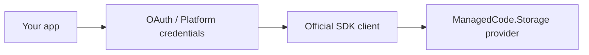
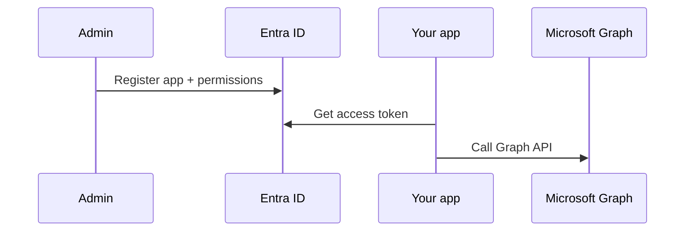
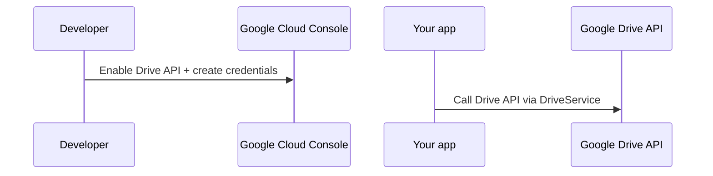
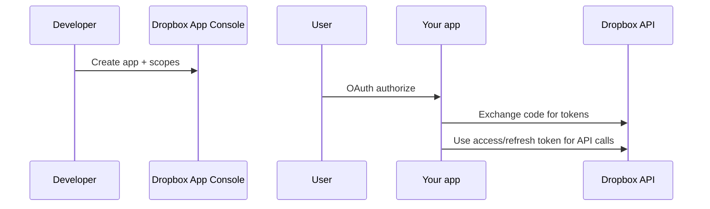
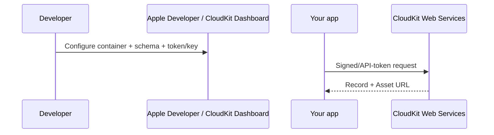

# Credentials & Auth (Cloud Drives + CloudKit)

This document explains how to obtain credentials for the providers that require OAuth / platform-specific keys:

- OneDrive (Microsoft Graph / Entra ID)
- Google Drive (Google APIs)
- Dropbox (Dropbox API)
- CloudKit (iCloud app data / CloudKit Web Services)

> iCloud Drive does not expose a public server-side file API. `ManagedCode.Storage.CloudKit` targets CloudKit app data, not iCloud Drive.

## Overview

## OneDrive (Microsoft Graph / Entra ID)

### What you need

- Entra ID (Azure AD) **tenant id**
- App registration **client id**
- Either:
  - **client secret** (server-to-server), or
  - a delegated flow (interactive user auth)

### Typical steps (server-to-server)

1. Create an Entra ID app registration.
2. Add Microsoft Graph **Application** permissions (example: `Files.ReadWrite.All` or `Sites.ReadWrite.All`) and grant admin consent.
3. Create a client secret and store it securely.

### Suggested configuration keys

- `OneDrive:TenantId`
- `OneDrive:ClientId`
- `OneDrive:ClientSecret`

## Google Drive (Google APIs)

### What you need

- Google Cloud project with **Google Drive API** enabled
- Either:
  - **Service account** JSON (server apps) + access to the target folder/drive, or
  - OAuth client id/secret (interactive user auth)

### Typical steps (service account)

1. Enable the Google Drive API.
2. Create a service account and download a JSON key.
3. Share the target folder/drive with the service account email so it can access files.

### Suggested configuration keys

- `GoogleDrive:ServiceAccountJsonPath`
- `GoogleDrive:RootFolderId`

## Dropbox

### What you need

- Dropbox App Console app
- App key (and optionally app secret)
- Either:
  - **access token** (quick/testing), or
  - **refresh token** (recommended for production “offline access”)

### Typical steps

1. Create an app in the Dropbox App Console (Scoped access, Full Dropbox or App folder).
2. Enable required scopes (example: `files.content.read`, `files.content.write`, `files.metadata.read`, `files.metadata.write`).
3. Obtain a token:
   - quick: generate an access token in the app console
   - production: use OAuth code flow to obtain an access token + refresh token

### Suggested configuration keys

- `Dropbox:AccessToken`
- `Dropbox:RefreshToken`
- `Dropbox:AppKey`
- `Dropbox:AppSecret`
- `Dropbox:RootPath` (example: `/Apps/<your-app>`)

## CloudKit (iCloud app data)

### What you need

- CloudKit container id (example: `iCloud.com.company.app`)
- CloudKit schema (record type + fields) for files
- Auth:
  - API token (`ckAPIToken`) **or**
  - server-to-server key + private key (for supported scenarios)

### Typical steps

1. Configure the container in CloudKit Dashboard and note the container id.
2. Ensure the record type exists (default `MCStorageFile`) and add fields:
   - `path` (String, queryable/indexed)
   - `contentType` (String)
   - `file` (Asset)
3. Create an API token for the container (or server-to-server key) and store it securely.

### Web auth token note (ckWebAuthToken)

If you use `ckWebAuthToken` (typically for user-scoped/private DB scenarios), CloudKit treats it as **single-use** and returns a rotated token on each response. The next request must use the new token.

`ManagedCode.Storage.CloudKit` will update `CloudKitStorageOptions.WebAuthToken` when a rotated token is returned, and serializes CloudKit requests when `WebAuthToken` is set (to avoid concurrent requests using an invalidated token).

### Suggested configuration keys

- `CloudKit:ContainerId`
- `CloudKit:ApiToken` (or `CloudKit:KeyId` + `CloudKit:PrivateKeyPem`)
- `CloudKit:Environment` (Development/Production)
- `CloudKit:Database` (Public/Private)
- `CloudKit:RootPath`
