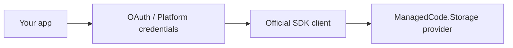
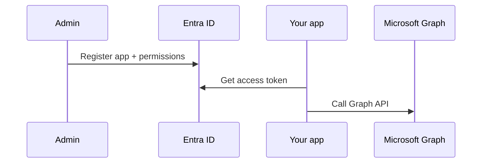
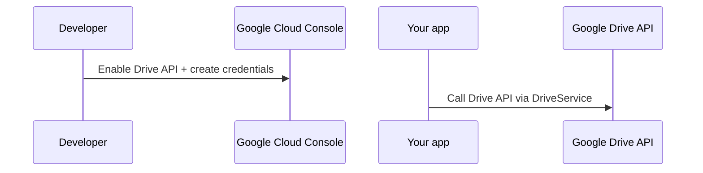
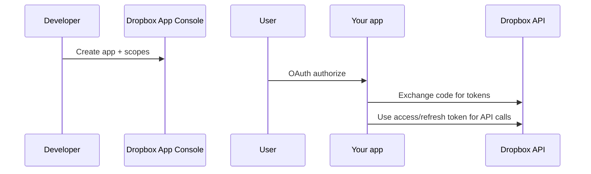
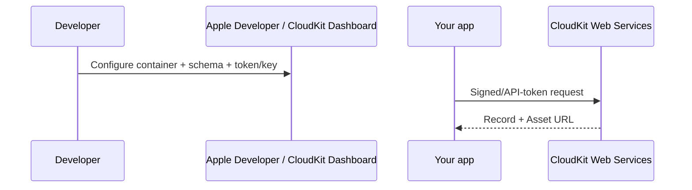

# Credentials & Auth (Cloud Drives + CloudKit)

This document explains how to obtain credentials for the providers that require OAuth / platform-specific keys:

- OneDrive (Microsoft Graph / Entra ID)
- Google Drive (Google APIs)
- Dropbox (Dropbox API)
- CloudKit (iCloud app data / CloudKit Web Services)

> iCloud Drive does not expose a public server-side file API. `ManagedCode.Storage.CloudKit` targets CloudKit app data, not iCloud Drive.

## Overview



## General rules

- Never commit secrets (OAuth tokens, client secrets, private keys). Use environment variables or user secrets.
- Prefer long-lived/rotatable credentials (refresh tokens / app credentials) for production services.
- For tests, prefer official-SDK + `HttpMessageHandler` fakes over mocking SDK interfaces.

## OneDrive (Microsoft Graph / Entra ID)

### What you need

- Entra ID (Azure AD) **tenant id**
- App registration **client id**
- Either:
  - **client secret** (server-to-server), or
  - a delegated flow (interactive user auth)

Microsoft docs:

- App registration: https://learn.microsoft.com/en-us/entra/identity-platform/quickstart-register-app
- Graph auth overview: https://learn.microsoft.com/en-us/graph/auth/
- Graph permissions reference: https://learn.microsoft.com/en-us/graph/permissions-reference



### Typical steps (server-to-server)

1. Create an Entra ID app registration.
2. Add Microsoft Graph **Application** permissions (example: `Files.ReadWrite.All` or `Sites.ReadWrite.All`) and grant admin consent.
3. Create a client secret and store it securely.

### Minimal `GraphServiceClient` example (client credentials)

```csharp
using Azure.Identity;
using Microsoft.Graph;

var tenantId = configuration["OneDrive:TenantId"]!;
var clientId = configuration["OneDrive:ClientId"]!;
var clientSecret = configuration["OneDrive:ClientSecret"]!;

var credential = new ClientSecretCredential(tenantId, clientId, clientSecret);
var graphClient = new GraphServiceClient(credential, new[] { "https://graph.microsoft.com/.default" });
```

### Minimal storage registration example

```csharp
using ManagedCode.Storage.OneDrive.Extensions;

builder.Services.AddOneDriveStorageAsDefault(options =>
{
    options.GraphClient = graphClient;
    options.DriveId = "me";
    options.RootPath = "app-data";
});
```

### Suggested configuration keys

- `OneDrive:TenantId`
- `OneDrive:ClientId`
- `OneDrive:ClientSecret`
- `OneDrive:DriveId` (optional; default is `me`)
- `OneDrive:RootPath` (optional; default is `/`)

### Advanced (optional)

- Swap point for tests/custom behaviour: `OneDriveStorageOptions.Client` (custom `IOneDriveClient`).
- You can also build `GraphServiceClient` with a custom `HttpClient`/handler for integration-like tests.
- For hermetic tests using a fake Graph HTTP transport, see `Tests/ManagedCode.Storage.Tests/Storages/CloudDrive/GraphOneDriveClientTests.cs`.

## Google Drive (Google APIs)

### What you need

- Google Cloud project with **Google Drive API** enabled
- Either:
  - **Service account** JSON (server apps) + access to the target folder/drive, or
  - OAuth client id/secret (interactive user auth)

Google docs:

- Drive API overview: https://developers.google.com/drive/api/guides/about-sdk
- Drive API quickstart (.NET): https://developers.google.com/drive/api/quickstart/dotnet
- OAuth 2.0: https://developers.google.com/identity/protocols/oauth2
- Service accounts: https://cloud.google.com/iam/docs/service-account-overview



### Typical steps (service account)

1. Enable the Google Drive API.
2. Create a service account and download a JSON key.
3. Share the target folder/drive with the service account email so it can access files.

### Minimal `DriveService` example (service account)

```csharp
using Google.Apis.Auth.OAuth2;
using Google.Apis.Drive.v3;
using Google.Apis.Services;

var serviceAccountJsonPath = configuration["GoogleDrive:ServiceAccountJsonPath"]!;

var credential = GoogleCredential
    .FromFile(serviceAccountJsonPath)
    .CreateScoped(DriveService.Scope.Drive);

var driveService = new DriveService(new BaseClientService.Initializer
{
    HttpClientInitializer = credential,
    ApplicationName = "MyApp"
});
```

### Minimal storage registration example

```csharp
using ManagedCode.Storage.GoogleDrive.Extensions;

builder.Services.AddGoogleDriveStorageAsDefault(options =>
{
    options.DriveService = driveService;
    options.RootFolderId = configuration["GoogleDrive:RootFolderId"] ?? "root";
});
```

### Suggested configuration keys

- `GoogleDrive:ServiceAccountJsonPath`
- `GoogleDrive:RootFolderId`

### Advanced (optional)

- Swap point for tests/custom behaviour: `GoogleDriveStorageOptions.Client` (custom `IGoogleDriveClient`).
- For hermetic tests you can build `DriveService` with a custom HTTP transport; see `Tests/ManagedCode.Storage.Tests/Storages/CloudDrive/GoogleDriveClientHttpTests.cs`.

## Dropbox

### What you need

- Dropbox App Console app
- App key (and optionally app secret)
- Either:
  - **access token** (quick/testing), or
  - **refresh token** (recommended for production “offline access”)

Dropbox docs:

- App Console: https://www.dropbox.com/developers/apps
- HTTP API docs: https://www.dropbox.com/developers/documentation/http/documentation
- OAuth guide: https://www.dropbox.com/developers/documentation/http/documentation#oauth2



### Typical steps

1. Create an app in the Dropbox App Console (Scoped access, Full Dropbox or App folder).
2. Enable required scopes (example: `files.content.read`, `files.content.write`, `files.metadata.read`, `files.metadata.write`).
3. Obtain a token:
   - quick: generate an access token in the app console
   - production: use OAuth code flow to obtain an access token + refresh token

### Minimal storage registration example

Access token (simple):

```csharp
using ManagedCode.Storage.Dropbox.Extensions;

builder.Services.AddDropboxStorageAsDefault(options =>
{
    options.AccessToken = configuration["Dropbox:AccessToken"];
    options.RootPath = "/Apps/my-app";
});
```

Refresh token (recommended for production/offline access):

```csharp
using ManagedCode.Storage.Dropbox.Extensions;

builder.Services.AddDropboxStorageAsDefault(options =>
{
    options.RefreshToken = configuration["Dropbox:RefreshToken"];
    options.AppKey = configuration["Dropbox:AppKey"];
    options.AppSecret = configuration["Dropbox:AppSecret"]; // optional in PKCE flows
    options.RootPath = "/Apps/my-app";
});
```

### Suggested configuration keys

- `Dropbox:AccessToken`
- `Dropbox:RefreshToken`
- `Dropbox:AppKey`
- `Dropbox:AppSecret`
- `Dropbox:RootPath` (example: `/Apps/<your-app>`)

### Advanced (optional)

- Swap point for tests/custom behaviour: `DropboxStorageOptions.Client` (custom `IDropboxClientWrapper`).
- Optional SDK injection: `DropboxStorageOptions.DropboxClient` / `DropboxStorageOptions.DropboxClientConfig` (custom HTTP, timeouts).
- For hermetic tests using the official SDK with a fake handler, see `Tests/ManagedCode.Storage.Tests/Storages/CloudDrive/DropboxClientWrapperHttpTests.cs`.

## CloudKit (iCloud app data)

### What you need

- CloudKit container id (example: `iCloud.com.company.app`)
- `ContainerId` is **not** a secret. It’s an identifier tied to your Apple App ID / bundle id.
- CloudKit schema (record type + fields) for files
- Auth:
  - API token (`ckAPIToken`) **or**
  - server-to-server key + private key (for supported scenarios)

Apple docs:

- CloudKit Dashboard: https://icloud.developer.apple.com/dashboard/
- CloudKit Web Services Reference: https://developer.apple.com/library/archive/documentation/DataManagement/Conceptual/CloudKitWebServicesReference/index.html



### Typical steps

1. Configure the container in CloudKit Dashboard and note the container id.
2. Ensure the record type exists (default `MCStorageFile`) and add fields:
   - `path` (String, queryable/indexed)
   - `contentType` (String)
   - `file` (Asset)
3. Create an API token for the container (or server-to-server key) and store it securely.

### Minimal storage registration example

```csharp
using ManagedCode.Storage.CloudKit.Extensions;
using ManagedCode.Storage.CloudKit.Options;

builder.Services.AddCloudKitStorageAsDefault(options =>
{
    options.ContainerId = configuration["CloudKit:ContainerId"]!; // identifier, not a secret
    options.Environment = CloudKitEnvironment.Production;
    options.Database = CloudKitDatabase.Public;
    options.RootPath = configuration["CloudKit:RootPath"] ?? "app-data";

    // Choose ONE auth mode:
    options.ApiToken = configuration["CloudKit:ApiToken"];
    // OR:
    // options.ServerToServerKeyId = configuration["CloudKit:KeyId"];
    // options.ServerToServerPrivateKeyPem = configuration["CloudKit:PrivateKeyPem"];
});
```

### “App-specific passwords” note

Apple “app-specific passwords” are intended for legacy protocols (e.g., Mail) and do not provide a supported, server-side “iCloud Drive” file API. For server-side storage, the supported option is CloudKit Web Services (this provider) — see [ADR 0001](../ADR/0001-icloud-drive-support.md) for the iCloud Drive vs CloudKit decision.

### Web auth token note (ckWebAuthToken)

If you use `ckWebAuthToken` (typically for user-scoped/private DB scenarios), CloudKit treats it as **single-use** and returns a rotated token on each response. The next request must use the new token.

`ManagedCode.Storage.CloudKit` will update `CloudKitStorageOptions.WebAuthToken` when a rotated token is returned, and serializes CloudKit requests when `WebAuthToken` is set (to avoid concurrent requests using an invalidated token).

### Suggested configuration keys

- `CloudKit:ContainerId`
- `CloudKit:ApiToken` (or `CloudKit:KeyId` + `CloudKit:PrivateKeyPem`)
- `CloudKit:Environment` (Development/Production)
- `CloudKit:Database` (Public/Private)
- `CloudKit:RootPath`

### Advanced (optional)

If you need to route/inspect CloudKit Web Services calls (proxy, custom handler in tests), you can provide either:

- `CloudKitStorageOptions.HttpClient` (preferred for most cases)
- `CloudKitStorageOptions.Client` (advanced swap point, useful for tests)

Example:

```csharp
var cloudKitHttpClient = new HttpClient
{
    Timeout = TimeSpan.FromSeconds(100)
};

builder.Services.AddCloudKitStorageAsDefault(options =>
{
    options.ContainerId = configuration["CloudKit:ContainerId"]!;
    options.Environment = CloudKitEnvironment.Production;
    options.Database = CloudKitDatabase.Public;

    options.ApiToken = configuration["CloudKit:ApiToken"];
    options.HttpClient = cloudKitHttpClient;
});
```
