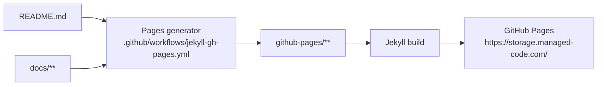

# GitHub Pages SEO Audit (Docs Site)

This document audits the SEO/readability essentials of the GitHub Pages docs site generated from `README.md` + `docs/**`.

## How the site is built

The docs site is produced by GitHub Actions by generating pages under `github-pages/` and then building with Jekyll.

## Site-wide checks (layout/config)

Source of truth:

- Layout: `github-pages/_layouts/default.html`
- Config: `github-pages/_config.yml`
- Sitemap: `github-pages/sitemap.xml`
- Robots: `github-pages/robots.txt`

### What’s covered

- **Title tags**: `Home` uses `site.title - site.tagline`; all other pages use `page.title | site.title`.
- **Meta descriptions**: every page has a `description` (manual for top-level pages, extracted for doc pages).
- **Keywords**: every page has `keywords` (manual for top-level pages, mapped for doc pages; falls back to site keywords).
- **Canonical URLs**: always include `site.url` + `site.baseurl` + `page.url` (GitHub Pages-friendly).
- **Open Graph / Twitter**: includes `og:title/description/url/image` and `twitter:*` equivalents.
- **Structured data (JSON-LD)**: includes `WebSite` and `SoftwareSourceCode`.
- **Sitemap**: includes all HTML pages except `/404.html`.
- **Robots**: site-wide `index,follow`; `/404.html` uses `noindex,follow`.

### High-impact fixes applied

- **Broken internal links**: source docs use `.md` links (good for GitHub), but the site renders `.html`. The generator rewrites `.md -> .html` for site pages.
- **Duplicate/generic meta descriptions**: doc pages now derive a description from the first meaningful paragraph (normalized, trimmed, max ~160 chars).
- **Social previews**: added an OG/Twitter image (`github-pages/assets/images/og-image.png`).
- **404 indexing**: `/404.html` is excluded from sitemap and marked `noindex`.

## Page-by-page audit

Notes:

- URLs below are **relative to** `https://storage.managed-code.com`.
- For doc pages (Features/API/ADR), `description` is generated from doc content by the workflow:
  - skips headings, code fences, bullet lists
  - skips ADR status lines (`Accepted/Proposed/...`)
  - normalizes whitespace, trims trailing `:`, truncates to ~160 chars

| URL | Title | Meta description | H1 | Notes |
| --- | --- | --- | --- | --- |
| `/` | Home | ManagedCode.Storage documentation: cross-provider storage toolkit for .NET and ASP.NET streaming scenarios. | ManagedCode.Storage | Title uses `site.title - site.tagline`; content from `README.md`. |
| `/setup.html` | Setup | How to clone, build, and run tests for ManagedCode.Storage. | Development Setup | Generated from `docs/Development/setup.md`. |
| `/credentials.html` | Credentials | How to obtain credentials for OneDrive, Google Drive, Dropbox, and CloudKit. | Credentials & Auth (Cloud Drives + CloudKit) | Generated from `docs/Development/credentials.md`. |
| `/testing.html` | Testing | Test strategy and how to run the ManagedCode.Storage test suite. | Testing Strategy | Generated from `docs/Testing/strategy.md`. |
| `/features/index.html` | Features | Documentation for major modules and providers in ManagedCode.Storage. | Features | Internal links rewritten (`.md` -> `.html`). |
| `/features/chunked-uploads.html` | Feature: Chunked Uploads (HTTP + Client) | Support reliable, resumable uploads of large files over unreliable connections by splitting a payload into chunks and completing with an integrity check (CRC32) | Feature: Chunked Uploads (HTTP + Client) |  |
| `/features/dependency-injection.html` | Feature: Dependency Injection & Keyed Registrations | Make storage wiring predictable and scalable for .NET apps by supporting both a single default `IStorage` and multiple keyed storage registrations (multi-tenan… | Feature: Dependency Injection & Keyed Registrations |  |
| `/features/integration-aspnet-server.html` | Feature: ASP.NET Server (`ManagedCode.Storage.Server`) | Expose storage operations over HTTP and SignalR on top of `IStorage` so ASP.NET apps can add streaming upload/download endpoints, chunked uploads, and live pro… | Feature: ASP.NET Server (`ManagedCode.Storage.Server`) |  |
| `/features/integration-dotnet-client.html` | Feature: .NET HTTP Client (`ManagedCode.Storage.Client`) | Typed .NET HTTP client for `ManagedCode.Storage.Server` endpoints: multipart uploads, downloads to `LocalFile`, and chunked uploads with progress + CRC32. | Feature: .NET HTTP Client (`ManagedCode.Storage.Client`) |  |
| `/features/integration-signalr-client.html` | Feature: .NET SignalR Client (`ManagedCode.Storage.Client.SignalR`) | Typed .NET SignalR client (`StorageSignalRClient`) for `StorageHub`: streaming upload/download helpers plus progress reporting and reconnection support. | Feature: .NET SignalR Client (`ManagedCode.Storage.Client.SignalR`) |  |
| `/features/mime-and-crc.html` | Feature: MIME & Integrity Helpers (MimeHelper + CRC32) | Provide consistent content-type and integrity behaviour across providers and integrations | Feature: MIME & Integrity Helpers (MimeHelper + CRC32) |  |
| `/features/provider-aws-s3.html` | Feature: Amazon S3 Provider (`ManagedCode.Storage.Aws`) | Implement `IStorage` on top of **Amazon S3**, including streaming and container (bucket) management semantics where applicable. | Feature: Amazon S3 Provider (`ManagedCode.Storage.Aws`) |  |
| `/features/provider-azure-blob.html` | Feature: Azure Blob Storage Provider (`ManagedCode.Storage.Azure`) | Implement `IStorage` on top of **Azure Blob Storage** using the Azure SDK, including streaming and metadata operations. | Feature: Azure Blob Storage Provider (`ManagedCode.Storage.Azure`) |  |
| `/features/provider-azure-datalake.html` | Feature: Azure Data Lake Gen2 Provider (`ManagedCode.Storage.Azure.DataLake`) | Implement `IStorage` on top of **Azure Data Lake Storage Gen2**. | Feature: Azure Data Lake Gen2 Provider (`ManagedCode.Storage.Azure.DataLake`) |  |
| `/features/provider-cloudkit.html` | Feature: CloudKit Provider (`ManagedCode.Storage.CloudKit`) | Expose **CloudKit Web Services** (iCloud app data) as `IStorage` so applications can store small/medium blobs in a CloudKit container. | Feature: CloudKit Provider (`ManagedCode.Storage.CloudKit`) |  |
| `/features/provider-dropbox.html` | Feature: Dropbox Provider (`ManagedCode.Storage.Dropbox`) | Expose **Dropbox** as `IStorage` so .NET apps can use the Dropbox API via a consistent upload/download/list/delete abstraction | Feature: Dropbox Provider (`ManagedCode.Storage.Dropbox`) |  |
| `/features/provider-filesystem.html` | Feature: File System Provider (`ManagedCode.Storage.FileSystem`) | Implement `IStorage` on top of the local file system so you can use the same abstraction in production code, local development, and tests | Feature: File System Provider (`ManagedCode.Storage.FileSystem`) |  |
| `/features/provider-google-cloud-storage.html` | Feature: Google Cloud Storage Provider (`ManagedCode.Storage.Gcp`) | Implement `IStorage` on top of **Google Cloud Storage (GCS)** using `Google.Cloud.Storage.V1`. | Feature: Google Cloud Storage Provider (`ManagedCode.Storage.Gcp`) |  |
| `/features/provider-googledrive.html` | Feature: Google Drive Provider (`ManagedCode.Storage.GoogleDrive`) | Expose **Google Drive** as `IStorage` so .NET apps can store files in Google Drive via the official Drive API while keeping OAuth/auth concerns in the hosting … | Feature: Google Drive Provider (`ManagedCode.Storage.GoogleDrive`) |  |
| `/features/provider-onedrive.html` | Feature: OneDrive Provider (`ManagedCode.Storage.OneDrive`) | Expose **OneDrive / Microsoft Graph** as `IStorage` so .NET apps can store files in a drive/folder via Graph using the same provider-agnostic upload/download/l… | Feature: OneDrive Provider (`ManagedCode.Storage.OneDrive`) |  |
| `/features/provider-sftp.html` | Feature: SFTP Provider (`ManagedCode.Storage.Sftp`) | Implement `IStorage` on top of SFTP using SSH (for legacy systems and air-gapped environments). | Feature: SFTP Provider (`ManagedCode.Storage.Sftp`) |  |
| `/features/storage-core.html` | Feature: Storage Core Abstraction (`ManagedCode.Storage.Core`) | Provide a single, provider-agnostic storage API for .NET so application code can upload/download/list/stream files without being coupled to vendor SDKs. | Feature: Storage Core Abstraction (`ManagedCode.Storage.Core`) |  |
| `/features/testfakes.html` | Feature: Test Fakes (`ManagedCode.Storage.TestFakes`) | Provide lightweight storage doubles for tests and demos, allowing consumers to replace real provider registrations without provisioning cloud resources. | Feature: Test Fakes (`ManagedCode.Storage.TestFakes`) |  |
| `/features/virtual-file-system.html` | Feature: Virtual File System (`ManagedCode.Storage.VirtualFileSystem`) | Expose a higher-level “virtual file system” API on top of `IStorage` | Feature: Virtual File System (`ManagedCode.Storage.VirtualFileSystem`) |  |
| `/adr/index.html` | ADR | Architecture Decision Records (ADR) for ManagedCode.Storage. | Architecture Decisions (ADR) | Internal links rewritten (`.md` -> `.html`). |
| `/adr/0001-icloud-drive-support.html` | ADR 0001: iCloud Drive Support vs CloudKit (Server-side) | This repository provides a provider-agnostic `IStorage` abstraction for server-side and cross-platform .NET apps. | ADR 0001: iCloud Drive Support vs CloudKit (Server-side) |  |
| `/api/index.html` | API | HTTP and SignalR API documentation for ManagedCode.Storage.Server. | API | Internal links rewritten (`.md` -> `.html`). |
| `/api/storage-server.html` | API: Storage Server (HTTP + SignalR) | This document describes the integration surface exposed by `Integraions/ManagedCode.Storage.Server`. | API: Storage Server (HTTP + SignalR) |  |
| `/templates.html` | Templates | Documentation templates used in this repository (Feature and ADR templates). | Templates | Lists `docs/templates/*.md` via links to GitHub. |
| `/404.html` | 404 | This page doesn't exist. Check the documentation navigation or go back home. | 404 | Noindex; excluded from sitemap. |

## Follow-up (optional)

If you want to push SEO further:

- Add per-page **breadcrumbs** JSON-LD for Features/API/ADR.
- Add a lightweight **search** (client-side) and emit `SearchAction` JSON-LD for the docs site.
- Add a proper 1200×630 OG image optimized for social previews (current image is the repo `logo.png` copied into the site).
