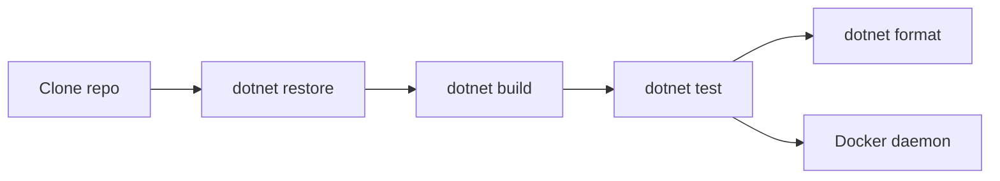

# Development Setup

## Prerequisites

- .NET SDK: **.NET 10** (`10.0.x`)
- Docker: required for Testcontainers-backed integration tests (Azurite / LocalStack / FakeGcsServer / SFTP)

## Workflow (Local)



## Clone

```bash
git clone https://github.com/managedcode/Storage.git
cd Storage
```

## Restore / Build / Test

Canonical commands (see `AGENTS.md`):

```bash
dotnet restore ManagedCode.Storage.slnx
dotnet build ManagedCode.Storage.slnx --configuration Release
dotnet test Tests/ManagedCode.Storage.Tests/ManagedCode.Storage.Tests.csproj --configuration Release
```

## Testing Strategy

The full test strategy (suite layout, categories, containers, cloud-drive HTTP fakes) lives in `docs/Testing/strategy.md`:

- [Testing Strategy](../Testing/strategy.md)

## Formatting

```bash
dotnet format ManagedCode.Storage.slnx
```

## Notes

- Start Docker Desktop (or your Docker daemon) before running the full test suite.
- Never commit secrets (cloud keys, OAuth tokens, connection strings). Use environment variables or user secrets.
- Credentials for cloud-drive providers are documented in `docs/Development/credentials.md`.
