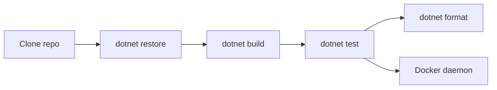

# Development Setup

## Prerequisites

- .NET SDK: **.NET 10** (`10.0.x`)
- Docker: required for Testcontainers-backed integration tests (Azurite / LocalStack / FakeGcsServer / SFTP)

## Workflow (Local)


```mermaid
flowchart LR
  A[Clone repo] --> B[dotnet restore]
  B --> C[dotnet build]
  C --> D[dotnet test]
  D --> E[dotnet format]
  D --> F[Docker daemon]
```

## Clone

```bash
git clone https://github.com/managedcode/Storage.git
cd Storage
```

## Restore / Build / Test

Canonical commands (see `AGENTS.md`):

```bash
dotnet restore ManagedCode.Storage.slnx
dotnet build ManagedCode.Storage.slnx --configuration Release
dotnet test Tests/ManagedCode.Storage.Tests/ManagedCode.Storage.Tests.csproj --configuration Release --filter "Category!=BrowserStress"
```

## Testing Strategy

The full test strategy (suite layout, categories, containers, cloud-drive HTTP fakes) lives in `docs/Testing/strategy.md`:

- [Testing Strategy](../Testing/strategy.md)

## Coverage

Local verification, PR validation and release use the same Coverlet MSBuild driver:

```bash
dotnet test Tests/ManagedCode.Storage.Tests/ManagedCode.Storage.Tests.csproj --configuration Release --filter "Category!=BrowserStress" /p:CollectCoverage=true
```

The test project writes `artifacts/coverage/coverage.json`, `coverage.cobertura.xml` and `coverage.opencover.xml`. The run fails below 85% total line coverage or 70% total branch coverage across the published packages. Only the two executable browser test hosts are outside this product metric; no production provider, including Browser or Data Lake, is excluded. CI preserves these artifacts and the test results, and uploads the exact Cobertura file to Codecov.

Browser end-to-end and stress verification remain required in both Interactive Server and WebAssembly. Managed browser-provider coverage is collected through the real Interactive Server process using the instrumented test output, with graceful shutdown before the report is finalized. WebAssembly outcomes are runtime verification and are not presented as separately measured managed-WASM coverage.

## Formatting

```bash
dotnet format ManagedCode.Storage.slnx
```

## Notes

- Cartograph provider tests create real local artifacts and need no cloud credentials or Docker. Run them with `dotnet test Tests/ManagedCode.Storage.Tests/ManagedCode.Storage.Tests.csproj --configuration Release --filter "FullyQualifiedName~Cartograph"`; the default suite includes them automatically.
- Start Docker Desktop (or your Docker daemon) before running the full test suite.
- AWS and Orleans integration tests intentionally pin LocalStack to `localstack/localstack:4.14.0`; do not switch them back to `latest`, because the end-of-March 2026 `latest` image became auth-gated and breaks CI without a token.
- GitHub Actions now use tiered browser large-file coverage: `build-and-test` keeps a fast `128 MiB` browser large-file lane in the default suite, while a separate `browser-stress` lane runs the heavier `256 MiB` browser stress checks automatically for CI and release gating.
- Never commit secrets (cloud keys, OAuth tokens, connection strings). Use environment variables or user secrets.
- Credentials for cloud-drive providers are documented in `docs/Development/credentials.md`.

### Regression scope for the coverage repair

The provider suites exercise SDKs against LocalStack, Azurite, FakeGcsServer and SFTP, including unavailable services and default/keyed registrations. GCS streaming tests use the emulator's filesystem backend. ADLS Gen2 uses the documented external protocol test exception in the test project's `AGENTS.md`; it does not qualify hosted Azure authentication.

The HTTP tests run the library's `StorageControllerBase` against Kestrel and the filesystem provider. They verify multipart field binding, chunk rejection, checksums, persisted bytes and HTTP ranges. The HTTP client preserves empty successful chunk acknowledgements and checks JSON `Result` failures before completing an upload.

Regression tests also cover offset and EOF handling in VFS reads, directory statistics, deletion-cache invalidation, failed synchronous/asynchronous write commits, canceled container creation, native SFTP upload cancellation, password/private-key SFTP round trips, and existing files without extensions. Actual InputFile browser uploads verify byte integrity through both memory/disk branches and controller/storage helpers, configured limits above 500 KB, and disposal of the upload-owned temporary files. Azure SDK stream creation and option callbacks retain container identity and credential references; Google Drive default options retain the shared-drive flag. `LocalFile` preserves the path of an existing extensionless file; generated extensionless paths retain their temporary-file naming policy.

The release workflow validates every published `.nupkg` against its packed identity, version and repository commit on the public NuGet feed before creating the GitHub release. A successful push command alone is not a publication receipt.

### Container versions and service qualification

Tests pin Azurite 3.37.0 and fake-gcs-server 1.56.1. The SFTP Alpine image is pinned to the multi-platform digest published on 2026-10-07. Floating `latest` tags can reuse older local images; explicit versions/digests keep local and CI infrastructure reproducible. LocalStack remains on the last pre-auth release 4.14.0: current 2026.09.0 requires a LocalStack auth token, which is not configured locally or in repository CI secrets.

fake-gcs-server 1.56.1 does not model temporary holds. The real SDK regression proves that an unsupported backend cannot be acknowledged as a successful hold: the returned object must confirm the requested state. Positive hosted GCS hold/authentication qualification remains separate. Azurite does not provide the Data Lake DFS hierarchical-namespace service. SFTP tests use a logical storage directory inside the writable upload mount; removal must delete that directory while preserving the protected chroot mount. Separate tests require a failure when attempting to remove entries protected by chroot-parent permissions.

The Orleans clear-state regression uses the actual running silo serializer and filesystem provider. `RecordExists=false` must survive serializers that omit CLR default values. The record property retains its existing public default of `true`; serialization attributes express that default and force System.Text.Json to preserve the flag. Field names/types and legacy positive records without the flag remain readable.

GCS fixture startup writes the launch script to a staging file, waits for copying to finish, and atomically renames it before the container shell reads it. This prevents the captured Testcontainers 4.16.0 extraction/execution race (`Text file busy`), while retaining the real emulator and dynamically mapped SDK upload endpoint. Concurrent startup regressions verify byte round trips with both memory and filesystem backends. The test project copies `xunit.runner.json` to its output and limits collection parallelism to four threads, keeping container creation bounded independently of the host CPU count.
