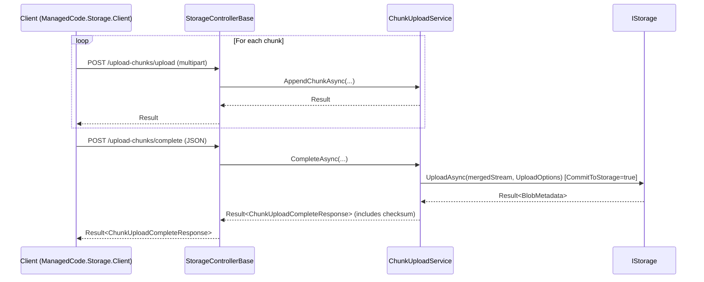

# Feature: Chunked Uploads (HTTP + Client)

## Purpose

Support reliable, resumable uploads of large files over unreliable connections by splitting a payload into chunks and completing with an integrity check (CRC32):

- server stages chunks to disk via `ChunkUploadService`
- server merges chunks and optionally commits to `IStorage`
- client computes CRC32 during upload and reports progress

## Main Flows

## Components

Server-side:

- `Integraions/ManagedCode.Storage.Server/ChunkUpload/ChunkUploadService.cs`
- `Integraions/ManagedCode.Storage.Server/ChunkUpload/ChunkUploadSession.cs`
- `Integraions/ManagedCode.Storage.Server/Models/FileUploadPayload.cs`
- `Integraions/ManagedCode.Storage.Server/Models/ChunkUploadCompleteRequest.cs`
- `Integraions/ManagedCode.Storage.Server/Models/ChunkUploadCompleteResponse.cs`
- Endpoints:
  - `Integraions/ManagedCode.Storage.Server/Controllers/StorageControllerBase.cs`

Client-side:

- `Integraions/ManagedCode.Storage.Client/StorageClient.cs` (`UploadLargeFile(...)`)
- CRC helpers:
  - `ManagedCode.Storage.Core/Helpers/Crc32Helper.cs`

## Current Behavior

- Chunks are staged under the server temp path (controlled by server options).
- Completion step merges chunks in order and can:
  - keep merged file on disk (`KeepMergedFile`)
  - commit merged file to `IStorage` (`CommitToStorage`)
- Client requires `StorageClient.ChunkSize` to be configured before uploading large files.

## Tests

- `Tests/ManagedCode.Storage.Tests/Server/ChunkUploadServiceTests.cs`
- `Tests/ManagedCode.Storage.Tests/Core/StorageClientChunkTests.cs`
- Controller-level flows:
  - `Tests/ManagedCode.Storage.Tests/AspNetTests/Abstracts/BaseUploadControllerTests.cs`
