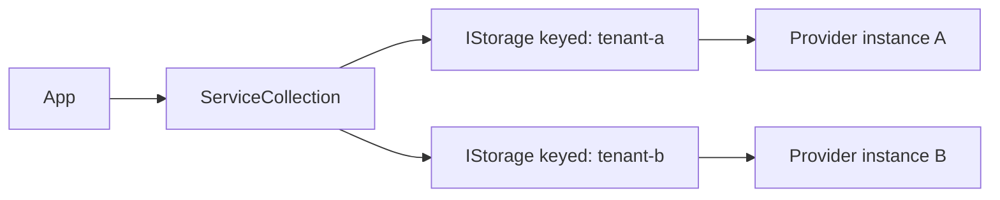

# Feature: Dependency Injection & Keyed Registrations

## Purpose

Make storage wiring predictable and scalable for .NET apps by supporting both a single default `IStorage` and multiple keyed storage registrations (multi-tenant, multi-region, mirroring):

- register a single `IStorage` as the **default** storage for the app
- register multiple storages side-by-side using **keyed DI** (multi-tenant, multi-region, mirroring, per-workload routing)
- keep provider construction consistent via provider-specific `Add*Storage...(...)` extensions

## Main Flows

### Default registration

```mermaid
flowchart LR
  App --> DI[ServiceCollection]
  DI --> Default[IStorage (default)]
  Default --> Provider[Concrete provider storage]
```

### Keyed registration (multi-storage)



## Components

Core factory abstractions:

- `ManagedCode.Storage.Core/Providers/IStorageProvider.cs` — provider contract used by the factory
- `ManagedCode.Storage.Core/Providers/IStorageFactory.cs` — creates storages from options
- `ManagedCode.Storage.Core/Providers/StorageFactory.cs` — resolves provider by options type and instantiates storages
- `ManagedCode.Storage.Core/Extensions/ServiceCollectionExtensions.cs` — `AddStorageFactory()`

Provider registrations:

- Each provider exposes `Add*Storage(...)` and `Add*StorageAsDefault(...)` (and keyed overloads).
- Examples:
  - `Storages/ManagedCode.Storage.Dropbox/Extensions/ServiceCollectionExtensions.cs`
  - `Storages/ManagedCode.Storage.GoogleDrive/Extensions/ServiceCollectionExtensions.cs`
  - `Storages/ManagedCode.Storage.OneDrive/Extensions/ServiceCollectionExtensions.cs`

Keyed DI:

- Uses built-in .NET keyed services:
  - `AddKeyedSingleton<T>(key, factory)`
  - resolve via `GetRequiredKeyedService<T>(key)` or `[FromKeyedServices("key")]`

## Current Behavior

- Default registrations bind `IStorage` to the provider-specific typed storage.
- Keyed registrations allow multiple independent options sets and storage instances.
- For cloud-drive providers, a “swap point” interface exists for testability:
  - OneDrive: `IOneDriveClient`
  - Google Drive: `IGoogleDriveClient`
  - Dropbox: `IDropboxClientWrapper`

## Tests

- `Tests/ManagedCode.Storage.Tests/Storages/CloudDrive/CloudDriveDependencyInjectionTests.cs`
- `Tests/ManagedCode.Storage.Tests/Storages/CloudDrive/CloudDriveStorageProviderTests.cs`
- `Tests/ManagedCode.Storage.Tests/ExtensionsTests/StoragePrivderExtensionsTests.cs`

## Definition of Done

- README includes default + keyed DI examples.
- Provider docs show minimal DI wiring.
- Tests prove keyed/default registrations resolve the expected services.
