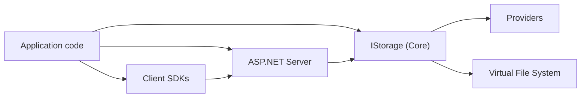

# Features

This folder documents the major modules in the repository.

> Note: the GitHub Pages docs generator publishes every `docs/Features/*.md` page automatically, but to make a page “visible” in the catalog/navigation you should also link it from this index.

## Core

- [Storage core abstraction](storage-core.md)
- [Dependency injection & keyed registrations](dependency-injection.md)
- [Virtual File System (VFS)](virtual-file-system.md)
- [MIME & integrity helpers (MimeHelper + CRC32)](mime-and-crc.md)
- [Test fakes](testfakes.md)

## Integrations

- [ASP.NET server (controllers + SignalR)](integration-aspnet-server.md)
- [.NET HTTP client](integration-dotnet-client.md)
- [.NET SignalR client](integration-signalr-client.md)
- [Chunked uploads (HTTP + client)](chunked-uploads.md)

## Providers

- [Azure Blob](provider-azure-blob.md)
- [Azure Data Lake Gen2](provider-azure-datalake.md)
- [Amazon S3](provider-aws-s3.md)
- [Google Cloud Storage](provider-google-cloud-storage.md)
- [File system](provider-filesystem.md)
- [SFTP](provider-sftp.md)
- [OneDrive (Microsoft Graph)](provider-onedrive.md)
- [Google Drive](provider-googledrive.md)
- [Dropbox](provider-dropbox.md)
- [CloudKit (iCloud app data)](provider-cloudkit.md)
