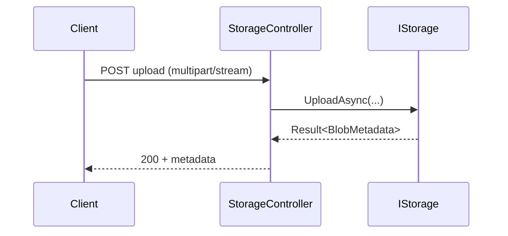

# Feature: ASP.NET Server (`ManagedCode.Storage.Server`)

## Purpose

Expose storage operations over HTTP and SignalR on top of `IStorage` so ASP.NET apps can add streaming upload/download endpoints, chunked uploads, and live progress:

- upload/download endpoints (including streaming)
- chunked uploads with merge + integrity checks
- SignalR hub for streaming uploads/downloads and progress

The server package is designed as a base layer: consumers can inherit controllers/hubs and customize routing/auth without being locked into rigid defaults.

## Main Flows

### HTTP upload/download



### Chunked upload

- `ChunkUploadService` stores incoming chunks into a temporary session.
- A completion request merges chunks and optionally commits to `IStorage`.

### SignalR streaming

- `StorageHub` streams bytes over SignalR and bridges to `IStorage` stream operations.

## Quickstart

```bash
dotnet add package ManagedCode.Storage.Server
```

```csharp
using ManagedCode.Storage.Server.Extensions;
using ManagedCode.Storage.Server.Extensions.DependencyInjection;

builder.Services.AddControllers();
builder.Services.AddStorageServer();
builder.Services.AddStorageSignalR(); // optional (SignalR streaming)

var app = builder.Build();
app.MapControllers(); // /api/storage/*
app.MapStorageHub();  // /hubs/storage
```

## Components

- Controllers:
  - `Integraions/ManagedCode.Storage.Server/Controllers/StorageControllerBase.cs`
  - `Integraions/ManagedCode.Storage.Server/Controllers/StorageController.cs`
- SignalR:
  - `Integraions/ManagedCode.Storage.Server/Hubs/StorageHubBase.cs`
  - `Integraions/ManagedCode.Storage.Server/Hubs/StorageHub.cs`
- Chunked upload:
  - `Integraions/ManagedCode.Storage.Server/ChunkUpload/ChunkUploadService.cs`
  - `Integraions/ManagedCode.Storage.Server/ChunkUpload/ChunkUploadSession.cs`
- Endpoint wiring:
  - `Integraions/ManagedCode.Storage.Server/Extensions/StorageEndpointRouteBuilderExtensions.cs`

## Current Behavior

- Controllers are “base-first”: `StorageControllerBase` is intended to be inherited so applications can override routing and auth.
- Chunk uploads are designed to be storage-provider agnostic (chunks are staged and merged via server-side logic).

## Tests

- `Tests/ManagedCode.Storage.Tests/Server/ChunkUploadServiceTests.cs`
- `Tests/ManagedCode.Storage.Tests/AspNetTests/*` (in-process test host for controllers + SignalR)

## References

- `docs/server-streaming-plan.md` (roadmap document)
