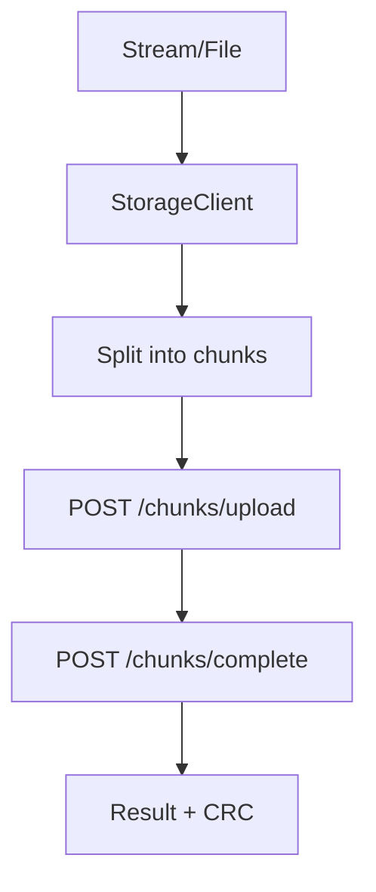

# Feature: .NET HTTP Client (`ManagedCode.Storage.Client`)

## Purpose

Typed .NET HTTP client for `ManagedCode.Storage.Server` endpoints: multipart uploads, downloads to `LocalFile`, and chunked uploads with progress + CRC32.

- multipart uploads
- downloads to `LocalFile`
- chunked uploads with progress + CRC32

## Main Flows

### Chunked upload with CRC



## Quickstart

```bash
dotnet add package ManagedCode.Storage.Client
```

```csharp
using ManagedCode.Storage.Client;

var http = new HttpClient { BaseAddress = new Uri("https://my-api.example") };
var client = new StorageClient(http);
client.SetChunkSize(5 * 1024 * 1024); // 5 MB

await using var stream = File.OpenRead("video.mp4");
var result = await client.UploadLargeFile(
    stream,
    uploadApiUrl: "/api/storage/upload-chunks/upload",
    completeApiUrl: "/api/storage/upload-chunks/complete",
    onProgressChanged: percent => Console.WriteLine($"{percent:F1}%"));
```

## Components

- `Integraions/ManagedCode.Storage.Client/IStorageClient.cs`
- `Integraions/ManagedCode.Storage.Client/StorageClient.cs`
- `Integraions/ManagedCode.Storage.Client/ProgressStatus.cs`

## Current Behavior

- `StorageClient.ChunkSize` must be set before `UploadLargeFile(...)`.
- CRC is computed during upload using `ManagedCode.Storage.Core.Helpers.Crc32Helper`.
- MIME type is resolved via `MimeHelper` based on file name.

## Tests

- `Tests/ManagedCode.Storage.Tests/Core/StorageClientChunkTests.cs`
