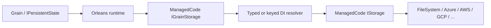

# Feature: Orleans Grain Persistence

## Purpose

`ManagedCode.Storage.Orleans` lets Orleans persist grain state through the same `IStorage` providers used everywhere else in this repository. The package does not care whether the backing store is a local folder, Azure Blob Storage, S3, Google Cloud Storage, or another ManagedCode provider: Orleans resolves an `IGrainStorage`, and that provider resolves a ManagedCode `IStorage`.

## Main Flow



## Registration Modes

### Typed storage registration

Use this when a concrete storage service is already registered in DI and you want Orleans to resolve that exact service type.

```csharp
using ManagedCode.Storage.FileSystem;
using ManagedCode.Storage.FileSystem.Extensions;
using Orleans.Hosting;
using Orleans.Runtime;

builder.Services.AddFileSystemStorageAsDefault(options =>
{
    options.BaseFolder = Path.Combine(builder.Environment.ContentRootPath, "grain-state");
});

builder.UseOrleans(siloBuilder =>
{
    siloBuilder.AddGrainStorage<IFileSystemStorage>("profiles", options =>
    {
        options.StateDirectory = "orleans";
        options.DeleteStateOnClear = true;
    });
});

public sealed class ProfileGrain(
    [PersistentState("profile", "profiles")] IPersistentState<ProfileState> profile)
    : Grain, IProfileGrain
{
    public async Task SetNameAsync(string name)
    {
        profile.State.Name = name;
        await profile.WriteStateAsync();
    }
}
```

### Keyed storage registration

Use this when storage is already partitioned by tenant, region, or workload through keyed DI.

```csharp
using ManagedCode.Storage.FileSystem.Extensions;
using Orleans.Hosting;

builder.Services.AddFileSystemStorageAsDefault("tenant-a", options =>
{
    options.BaseFolder = Path.Combine(builder.Environment.ContentRootPath, "tenant-a-state");
});

builder.UseOrleans(siloBuilder =>
{
    siloBuilder.AddGrainStorage("profiles", "tenant-a", options =>
    {
        options.StateDirectory = "orleans";
        options.PathBuilder = context =>
            $"state/{context.ProviderName}/{context.StateName}/{context.GrainId}.state";
    });
});
```

### Options-only registration

If you prefer to wire storage resolution manually, configure `StorageFactory`, `StorageServiceType`, or `StorageKey` on `ManagedCodeStorageGrainStorageOptions`. Resolution order is:

1. `StorageFactory`
2. `StorageServiceType + StorageKey`
3. `StorageServiceType`
4. `StorageKey`
5. default `IStorage`

## Storage Semantics

- `StateDirectory` controls the root prefix for persisted grain state files.
- `PathBuilder` lets you fully control the blob/path naming strategy.
- `DeleteStateOnClear` decides whether `ClearStateAsync` deletes the state file or writes a tombstone record.
- `GrainStorageSerializer` follows Orleans provider conventions, so you can plug in a custom `IGrainStorageSerializer` if you need version-tolerant or domain-specific serialization.

The provider stores a logical Orleans ETag next to the serialized state and checks that value before overwriting a record. That gives stale-writer detection across all ManagedCode backends. Because the underlying `IStorage` abstraction does not expose backend-native compare-and-swap primitives today, this is a provider-level optimistic check rather than a backend-native atomic write condition.

## Definition of Done

- Orleans grains can persist through typed ManagedCode storage registrations.
- Orleans grains can persist through keyed ManagedCode storage registrations.
- Grain read, write, clear, and stale-write detection are covered by automated tests.
- README lists the package and shows basic Orleans wiring.
