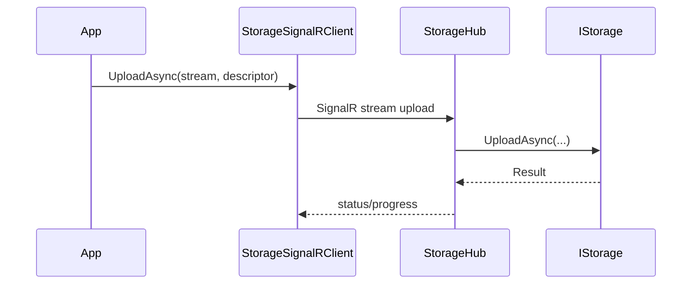

# Feature: .NET SignalR Client (`ManagedCode.Storage.Client.SignalR`)

## Purpose

Typed .NET SignalR client (`StorageSignalRClient`) for `StorageHub`: streaming upload/download helpers plus progress reporting and reconnection support.

- streaming upload/download helpers
- progress reporting and reconnection support via `StorageSignalRClientOptions`

## Main Flows

## Components

- `Integraions/ManagedCode.Storage.Client.SignalR/StorageSignalRClient.cs`
- `Integraions/ManagedCode.Storage.Client.SignalR/StorageSignalRClientOptions.cs`
- `Integraions/ManagedCode.Storage.Client.SignalR/StorageSignalREventNames.cs`
- `Integraions/ManagedCode.Storage.Client.SignalR/Models/*`

## Current Behavior

- The client is transport-agnostic as long as it can connect to the server hub URL.
- Progress updates are exposed via strongly-typed status models.

## Tests

- `Tests/ManagedCode.Storage.Tests/AspNetTests/Abstracts/BaseSignalRStorageTests.cs`
- `Tests/ManagedCode.Storage.Tests/AspNetTests/Azure/AzureSignalRStorageTests.cs`
