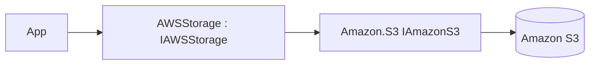

# Feature: Amazon S3 Provider (`ManagedCode.Storage.Aws`)

## Purpose

Implement `IStorage` on top of **Amazon S3**, including streaming and container (bucket) management semantics where applicable.

## Main Flows



## Components

- `Storages/ManagedCode.Storage.Aws/AWSStorage.cs`
- `Storages/ManagedCode.Storage.Aws/AWSStorageProvider.cs`
- `Storages/ManagedCode.Storage.Aws/BlobStream.cs`
- DI:
  - `Storages/ManagedCode.Storage.Aws/Extensions/ServiceCollectionExtensions.cs`
  - `Storages/ManagedCode.Storage.Aws/Extensions/StorageFactoryExtensions.cs`
- Options:
  - `Storages/ManagedCode.Storage.Aws/Options/AWSStorageOptions.cs`

## DI Wiring

```bash
dotnet add package ManagedCode.Storage.Aws
```

```csharp
using Amazon.S3;
using ManagedCode.Storage.Aws.Extensions;

builder.Services.AddAWSStorageAsDefault(options =>
{
    options.Bucket = "my-bucket";
    options.PublicKey = configuration["Aws:AccessKeyId"];
    options.SecretKey = configuration["Aws:SecretAccessKey"];
    options.OriginalOptions = new AmazonS3Config { RegionEndpoint = Amazon.RegionEndpoint.USEast1 };
});
```

## Current Behavior

- Supports multiple auth modes (access keys / role / instance profile) via `AWSStorageOptions`.
- Can create the bucket when `CreateContainerIfNotExists = true`.

## Tests

- `Tests/ManagedCode.Storage.Tests/Storages/AWS/AWSUploadTests.cs`
- `Tests/ManagedCode.Storage.Tests/Storages/AWS/AWSDownloadTests.cs`
- `Tests/ManagedCode.Storage.Tests/Storages/AWS/AWSBlobTests.cs`
- `Tests/ManagedCode.Storage.Tests/Storages/AWS/AWSContainerTests.cs`
- `Tests/ManagedCode.Storage.Tests/Storages/AWS/AwsConfigTests.cs`
