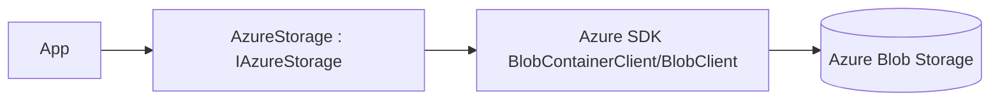

# Feature: Azure Blob Storage Provider (`ManagedCode.Storage.Azure`)

## Purpose

Implement `IStorage` on top of **Azure Blob Storage** using the Azure SDK, including streaming and metadata operations.

## Main Flows



## Components

- Core types:
  - `Storages/ManagedCode.Storage.Azure/AzureStorage.cs`
  - `Storages/ManagedCode.Storage.Azure/AzureStorageProvider.cs`
  - `Storages/ManagedCode.Storage.Azure/BlobStream.cs` (stream helpers)
- DI:
  - `Storages/ManagedCode.Storage.Azure/Extensions/ServiceCollectionExtensions.cs`
  - `Storages/ManagedCode.Storage.Azure/Extensions/StorageFactoryExtensions.cs`
- Options:
  - `Storages/ManagedCode.Storage.Azure/Options/AzureStorageOptions.cs` (connection string)
  - `Storages/ManagedCode.Storage.Azure/Options/AzureStorageCredentialsOptions.cs` (token credential)

## DI Wiring

```bash
dotnet add package ManagedCode.Storage.Azure
```

```csharp
using ManagedCode.Storage.Azure.Extensions;

builder.Services.AddAzureStorageAsDefault(options =>
{
    options.Container = "my-container";
    options.ConnectionString = configuration["Azure:ConnectionString"];
});
```

## Current Behavior

- Supports container creation when `CreateContainerIfNotExists = true`.
- Uses Azure SDK transfer options when configured (`UploadTransferOptions`).

## Tests

- `Tests/ManagedCode.Storage.Tests/Storages/Azure/AzureUploadTests.cs`
- `Tests/ManagedCode.Storage.Tests/Storages/Azure/AzureDownloadTests.cs`
- `Tests/ManagedCode.Storage.Tests/Storages/Azure/AzureBlobTests.cs`
- `Tests/ManagedCode.Storage.Tests/Storages/Azure/AzureBlobStreamTests.cs`
- `Tests/ManagedCode.Storage.Tests/Storages/Azure/AzureContainerTests.cs`
- `Tests/ManagedCode.Storage.Tests/Storages/Azure/AzureConfigTests.cs`

## References

- `README.md` (package list + general usage)
- Azure SDK docs (Blob Storage)
