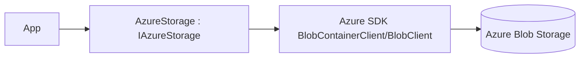
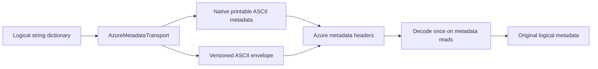

# Feature: Azure Blob Storage Provider (`ManagedCode.Storage.Azure`)

## Purpose

Implement `IStorage` on top of **Azure Blob Storage** using the Azure SDK, including streaming and metadata operations.

## Main Flows


```mermaid
flowchart LR
  App --> AzureStorage[AzureStorage : IAzureStorage]
  AzureStorage --> BlobClient[Azure SDK BlobContainerClient/BlobClient]
  BlobClient --> Azure[(Azure Blob Storage)]
```

## Components

- Core types:
  - `Storages/ManagedCode.Storage.Azure/AzureStorage.cs`
  - `Storages/ManagedCode.Storage.Azure/AzureStorageProvider.cs`
  - `Storages/ManagedCode.Storage.Azure/BlobStream.cs` (stream helpers)
- DI:
  - `Storages/ManagedCode.Storage.Azure/Extensions/ServiceCollectionExtensions.cs`
  - `Storages/ManagedCode.Storage.Azure/Extensions/StorageFactoryExtensions.cs`
- Options:
  - `Storages/ManagedCode.Storage.Azure/Options/AzureStorageOptions.cs` (connection string)
  - `Storages/ManagedCode.Storage.Azure/Options/AzureStorageCredentialsOptions.cs` (token credential)

## DI Wiring

```bash
dotnet add package ManagedCode.Storage.Azure
```

```csharp
using ManagedCode.Storage.Azure.Extensions;

builder.Services.AddAzureStorageAsDefault(options =>
{
    options.Container = "my-container";
    options.ConnectionString = configuration["Azure:ConnectionString"];
});
```

## Current Behavior

- Supports container creation when `CreateContainerIfNotExists = true`.
- Uses Azure SDK transfer options when configured (`UploadTransferOptions`).
- Builds the upload result from the successful Azure upload response and the caller's options, without issuing a second blob-properties request that can race with deletion or lifecycle processing.
- Returns a failed metadata result for an absent blob without logging the expected Azure `404 BlobNotFound` response as an unhandled exception; other metadata failures retain error logging.
- Preserves Unicode and control characters in logical metadata through uploads, downloads, metadata/listing reads, conditional object writes, multipart commits and container operations. The Azure provider owns the HTTP-header representation; callers pass their original strings.

## Metadata transport

Ordinary metadata with native Azure identifier keys and printable ASCII values
is stored directly. A dictionary requiring encoding is stored as one reserved
`managedcode_storage_metadata_v1` value: `utf8-json-base64:` followed by the
base64 of the complete UTF-8 JSON string dictionary. Reads restore the logical
dictionary once. A caller-supplied reserved key is itself wrapped, so its value
cannot be confused with provider metadata. Invalid recognized envelopes fail
instead of returning opaque transport values. Invalid UTF-16 input is rejected
before writing; the provider never substitutes characters.


```mermaid
flowchart LR
  Caller["Logical string dictionary"] --> Transport["AzureMetadataTransport"]
  Transport --> Native["Native printable ASCII metadata"]
  Transport --> Envelope["Versioned ASCII envelope"]
  Native --> Azure["Azure metadata headers"]
  Envelope --> Azure
  Azure --> Decode["Decode once on metadata reads"]
  Decode --> Result["Original logical metadata"]
```

Azure's physical metadata-size limits still apply, including envelope overhead.
Content bytes, content type, conditional ETags and exact immutable retry matching
are unchanged. Objects written directly with ordinary native ASCII metadata
remain readable without reinterpretation of percent escapes or value prefixes.

## Tests

- `Tests/ManagedCode.Storage.Tests/Storages/Azure/AzureUploadTests.cs`
- `Tests/ManagedCode.Storage.Tests/Storages/Azure/AzureDownloadTests.cs`
- `Tests/ManagedCode.Storage.Tests/Storages/Azure/AzureBlobTests.cs`
- `Tests/ManagedCode.Storage.Tests/Storages/Azure/AzureBlobStreamTests.cs`
- `Tests/ManagedCode.Storage.Tests/Storages/Azure/AzureContainerTests.cs`
- `Tests/ManagedCode.Storage.Tests/Storages/Azure/AzureConfigTests.cs`
- [Azure metadata regressions](https://github.com/managed-code-hub/Storage/blob/main/Tests/ManagedCode.Storage.Tests/Storages/Azure/AzureMetadataEncodingTests.cs): real Azurite round trips, native metadata interoperability, marker collisions, malformed envelopes, exact retry and stale revision rejection.

## References

- `README.md` (package list + general usage)
- Azure SDK docs (Blob Storage)
