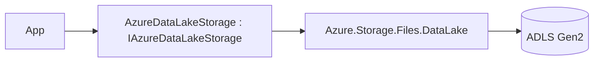

# Feature: Azure Data Lake Gen2 Provider (`ManagedCode.Storage.Azure.DataLake`)

## Purpose

Implement `IStorage` on top of **Azure Data Lake Storage Gen2**.

## Main Flows



## Components

- `Storages/ManagedCode.Storage.Azure.DataLake/AzureDataLakeStorage.cs`
- `Storages/ManagedCode.Storage.Azure.DataLake/AzureDataLakeStorageProvider.cs`
- DI:
  - `Storages/ManagedCode.Storage.Azure.DataLake/Extensions/ServiceCollectionExtensions.cs`
  - `Storages/ManagedCode.Storage.Azure.DataLake/Extensions/StorageFactoryExtensions.cs`
- Options:
  - `Storages/ManagedCode.Storage.Azure.DataLake/Options/AzureDataLakeStorageOptions.cs`
  - `Storages/ManagedCode.Storage.Azure.DataLake/Options/OpenReadStreamOptions.cs`
  - `Storages/ManagedCode.Storage.Azure.DataLake/Options/OpenWriteStreamOptions.cs`

## DI Wiring

```bash
dotnet add package ManagedCode.Storage.Azure.DataLake
```

```csharp
using ManagedCode.Storage.Azure.DataLake.Extensions;

builder.Services.AddAzureDataLakeStorageAsDefault(options =>
{
    options.FileSystem = "my-filesystem";
    options.ConnectionString = configuration["AzureDataLake:ConnectionString"]!;
});
```

## Current Behavior

- Uses `ConnectionString` + `FileSystem` as the “container” equivalent.
- Creates the filesystem automatically when `CreateContainerIfNotExists = true`.

## Tests

- `Tests/ManagedCode.Storage.Tests/Storages/Azure/AzureDataLakeTests.cs`
