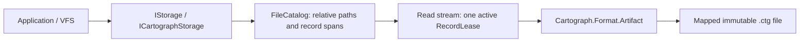

# Cartograph Provider (`ManagedCode.Storage.Cartograph`)

## Purpose

Read files packed into an immutable [Cartograph](https://github.com/angelhernandezm/Cartograph) artifact using the existing Storage abstraction. The provider is a separate package; Core, other providers, and consuming applications do not need to understand Cartograph records or their lease lifetime.



## Installation And Registration

```bash
dotnet add package ManagedCode.Storage.Cartograph
```

The module depends on the published `Cartograph.Catalog` `0.1.0-alpha` package, which brings `Cartograph.Format` and the Cartograph mapped-memory substrate. Use .NET 10 and a 64-bit process. Cartograph's artifact and catalog formats are experimental; create artifacts with the matching dependency version.

Packing with Storage's shared stable version emits NuGet warning `NU5104` because Cartograph is a prerelease dependency. The dependency remains explicit and pinned; the warning is not suppressed.

```csharp
using ManagedCode.Storage.Cartograph;
using ManagedCode.Storage.Cartograph.Extensions;
using ManagedCode.Storage.Core;
using Microsoft.Extensions.DependencyInjection;

services.AddCartographStorageAsDefault(options =>
    options.ArtifactPath = Path.GetFullPath("documents.ctg"));

// IStorage and ICartographStorage resolve to the same instance.
var storage = serviceProvider.GetRequiredService<IStorage>();
```

For provider-specific injection, use `AddCartographStorage` and resolve `ICartographStorage`. Multiple artifacts can be registered independently:

```csharp
services.AddCartographStorageAsDefault("documents", options =>
    options.ArtifactPath = Path.GetFullPath("documents.ctg"));
services.AddCartographStorageAsDefault("media", options =>
    options.ArtifactPath = Path.GetFullPath("media.ctg"));

var documents = serviceProvider.GetRequiredKeyedService<IStorage>("documents");
var media = serviceProvider.GetRequiredKeyedService<ICartographStorage>("media");
```

Each `AddCartographStorageAsDefault(key, ...)` registers the typed and `IStorage` aliases under that key. It does not set the unkeyed default. Both keyed and unkeyed registrations make the provider available to StorageFactory:

```csharp
using ManagedCode.Storage.Core.Extensions;
using ManagedCode.Storage.Core.Providers;

services.AddStorageFactory();
var factory = serviceProvider.GetRequiredService<IStorageFactory>();
using var archive = factory.CreateCartographStorage(Path.GetFullPath("archive.ctg"));
```

The factory also accepts `CartographStorageOptions` or a configuration action.

## Reading And Downloading

```csharp
var result = await storage.GetStreamAsync("reports/annual.pdf", cancellationToken);
if (result.IsFailed)
    throw new IOException(result.Problem?.Detail);

await using var source = result.Value;
await using var destination = File.Create("annual.pdf");
await source.CopyToAsync(destination, cancellationToken);

var metadata = await storage.GetBlobMetadataAsync("reports/annual.pdf", cancellationToken);
var exists = await storage.ExistsAsync("reports/annual.pdf", cancellationToken);
await foreach (var file in storage.GetBlobMetadataListAsync("reports", cancellationToken))
    Console.WriteLine($"{file.FullName}: {file.Length} bytes");
```

`DownloadAsync` streams to a sibling staging file, then replaces its `LocalFile` destination after the complete checksummed read succeeds. A read failure or cancellation preserves an existing destination and removes the staging file. Dispose a returned temporary `LocalFile` to remove it; an explicit `DownloadOptions.LocalPath` is retained. `Directory` and `FileName` options combine into a relative catalog path. A destination equal to the artifact path, including a symbolic-link alias, is rejected.

## Supported Behavior

| Operation | Behavior |
| --- | --- |
| `GetStreamAsync` | Sequential, read-only stream over the file's consecutive records. `CanSeek` and `CanWrite` are false; `Length` is the file size and `Position` counts consumed bytes. |
| `DownloadAsync` | Streams exact file bytes to disk and includes catalog-derived `BlobMetadata`. |
| `ExistsAsync` | Ordinal, case-sensitive catalog lookup; a missing file returns successful `false`. |
| `GetBlobMetadataAsync` | Relative full name, file name, byte length, catalog creation time, source modification time, MIME from `MimeHelper`, and artifact URI with the entry path as its fragment. |
| `GetBlobMetadataListAsync` | Recursively lists the selected directory using a slash-delimited prefix; `reports` excludes `reports-old`. No directory lists every file. |
| `CreateContainerAsync` | Opens and validates an existing artifact and its catalog. Never creates or changes a file, including when `CreateContainerIfNotExists` is true. |
| Upload, delete, directory delete, container removal, legal holds | Failed `Result` with `NotSupportedException`; artifact bytes are unchanged. |

## Catalog Convention And Lifetimes

Create the artifact with Cartograph's catalog-aware writer or [roundtrip harness](https://github.com/angelhernandezm/Cartograph/tree/main/harnesses/Cartograph.Harness). A plain record-only artifact has no file names and cannot be used by this provider.

| Catalog field | Meaning |
| --- | --- |
| Segment 0, record 0 | The sole record in the first segment is a serialized `FileCatalog`. |
| `RelativePath` | Unique forward-slash path within the packed root. Absolute paths, traversal components, and empty path components are rejected. |
| `SegmentIndex` / `RecordIndex` / `RecordCount` | Valid consecutive content records within a content segment. Empty files still have a record. |
| `GlobalIndex` | Must agree with the segment and record indices. |
| `Length` | Must match the sum of the record-directory lengths; validation does not read file payloads. |
| `LastWriteUtcTicks` | A valid UTC timestamp used for file metadata. |
| `SourceRoot` | Informational catalog data; never resolved on the host filesystem. |

Opening reads format metadata and the catalog. Payloads are read only when requested, and Cartograph verifies each accessed record's checksum. Reads span as many records as needed without loading the entire file into a managed buffer. The catalog and record-directory metadata remain in memory; choose reasonable record sizes when packing large files.

Each returned stream owns an independent artifact snapshot, so concurrent streams do not share a cursor. Disposing Storage or changing its options does not invalidate already returned streams. Dispose each stream to release its current record lease and mapped artifact. Cancellation is observed before opening and between record reads. Result-based operations report failures through `Result`; stream reads and asynchronous enumeration throw on cancellation or corrupt payloads.

Keep the backing artifact unchanged for the lifetime of every open stream. VFS can expose the provider's existing files; writes through VFS still fail because the artifact is immutable.

## Components And Tests

- [Provider module](https://github.com/managedcode/Storage/tree/main/Storages/ManagedCode.Storage.Cartograph)
- [Storage entry point](https://github.com/managedcode/Storage/blob/main/Storages/ManagedCode.Storage.Cartograph/CartographStorage.cs)
- [DI registrations](https://github.com/managedcode/Storage/blob/main/Storages/ManagedCode.Storage.Cartograph/Extensions/ServiceCollectionExtensions.cs)
- [Real artifact tests](https://github.com/managedcode/Storage/tree/main/Tests/ManagedCode.Storage.Tests/Storages/Cartograph)

The regression suite writes artifacts with the published Cartograph writer and verifies split records, Unicode and empty files, concurrent readers, stream disposal, downloads, metadata, directory boundaries, invalid catalogs, corrupt payloads, unsupported mutations, DI/factory resolution, and VFS reads. No mocks or replacement Cartograph implementation are used.

Coverage scope exception: the repository-wide Coverlet aggregate includes existing gaps in older providers, integrations, TestFakes, and executable browser hosts, and remains below the root's 85–90% aspiration. This provider addition preserves the full default suite and requires over 90% line coverage for the new module. Raising the existing aggregate is outside this module's scope; remove this exception through a separately scoped coverage improvement while retaining the unfiltered report and existing assertions.
