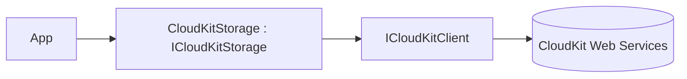

# Feature: CloudKit Provider (`ManagedCode.Storage.CloudKit`)

## Purpose

Expose **CloudKit Web Services** (iCloud app data) as `IStorage` so applications can store small/medium blobs in a CloudKit container.

> Note: iCloud Drive does not provide an official server-side file API. This provider targets CloudKit app data, not iCloud Drive.

## Main Flows



## Components

- Storage:
  - `Storages/ManagedCode.Storage.CloudKit/CloudKitStorage.cs`
  - `Storages/ManagedCode.Storage.CloudKit/CloudKitStorageProvider.cs`
- Client:
  - `Storages/ManagedCode.Storage.CloudKit/Clients/CloudKitClient.cs`
  - `Storages/ManagedCode.Storage.CloudKit/Clients/ICloudKitClient.cs`
- Options / DI:
  - `Storages/ManagedCode.Storage.CloudKit/Options/CloudKitStorageOptions.cs`
  - `Storages/ManagedCode.Storage.CloudKit/Extensions/ServiceCollectionExtensions.cs`
- Supporting models:
  - `Storages/ManagedCode.Storage.CloudKit/Clients/CloudKitRecord.cs`

## DI Wiring

```bash
dotnet add package ManagedCode.Storage.CloudKit
```

```csharp
using ManagedCode.Storage.CloudKit.Extensions;
using ManagedCode.Storage.CloudKit.Options;

builder.Services.AddCloudKitStorageAsDefault(options =>
{
    options.ContainerId = "iCloud.com.company.app";
    options.Environment = CloudKitEnvironment.Production;
    options.Database = CloudKitDatabase.Public;
    options.RootPath = "app-data";
    options.ApiToken = configuration["CloudKit:ApiToken"];
});
```

## Current Behavior

- Supports multiple auth modes:
  - API token (`ckAPIToken`) via `CloudKitStorageOptions.ApiToken`
  - optional web auth token (`ckWebAuthToken`) for user-scoped scenarios (rotated by CloudKit on each request)
  - server-to-server signed requests for supported scenarios via `ServerToServerKeyId` + `ServerToServerPrivateKeyPem`
- Record type/field names are configurable to match CloudKit schema:
  - `RecordType` (default `MCStorageFile`)
  - `PathFieldName`, `AssetFieldName`, `ContentTypeFieldName`

## Tests

- HTTP/SDK-level fake:
  - `Tests/ManagedCode.Storage.Tests/Storages/CloudKit/FakeCloudKitHttpHandler.cs`
  - `Tests/ManagedCode.Storage.Tests/Storages/CloudKit/CloudKitClientHttpTests.cs`
- Storage behaviour via fake client:
  - `Tests/ManagedCode.Storage.Tests/Storages/CloudKit/CloudKitStorageTests.cs`
- DI + provider plumbing:
  - `Tests/ManagedCode.Storage.Tests/Storages/CloudKit/CloudKitDependencyInjectionTests.cs`
  - `Tests/ManagedCode.Storage.Tests/Storages/CloudKit/CloudKitStorageProviderTests.cs`

## Configuration Notes

See `docs/Development/credentials.md` and `README.md` for step-by-step CloudKit setup (container id, schema, and tokens/keys).
