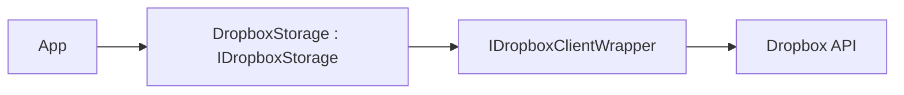

# Feature: Dropbox Provider (`ManagedCode.Storage.Dropbox`)

## Purpose

Expose **Dropbox** as `IStorage` so .NET apps can use the Dropbox API via a consistent upload/download/list/delete abstraction:

- upload/download/list/delete through a consistent API
- support “library-managed client creation” from credentials for the common cases
- keep a clean swap point (`IDropboxClientWrapper`) for tests and advanced scenarios

## Main Flows



## Components

- Storage:
  - `Storages/ManagedCode.Storage.Dropbox/DropboxStorage.cs`
  - `Storages/ManagedCode.Storage.Dropbox/DropboxStorageProvider.cs`
- Client wrapper:
  - `Storages/ManagedCode.Storage.Dropbox/Clients/DropboxClientWrapper.cs`
  - `Storages/ManagedCode.Storage.Dropbox/Clients/IDropboxClientWrapper.cs`
- Options / DI:
  - `Storages/ManagedCode.Storage.Dropbox/Options/DropboxStorageOptions.cs`
  - `Storages/ManagedCode.Storage.Dropbox/Extensions/ServiceCollectionExtensions.cs`

## DI Wiring

```bash
dotnet add package ManagedCode.Storage.Dropbox
```

Access token (simple):

```csharp
using ManagedCode.Storage.Dropbox.Extensions;

builder.Services.AddDropboxStorageAsDefault(options =>
{
    options.AccessToken = configuration["Dropbox:AccessToken"];
    options.RootPath = "/Apps/my-app";
});
```

Refresh token (recommended for production/offline access):

```csharp
using ManagedCode.Storage.Dropbox.Extensions;

builder.Services.AddDropboxStorageAsDefault(options =>
{
    options.RefreshToken = configuration["Dropbox:RefreshToken"];
    options.AppKey = configuration["Dropbox:AppKey"];
    options.AppSecret = configuration["Dropbox:AppSecret"]; // optional in PKCE flows
    options.RootPath = "/Apps/my-app";
});
```

## Current Behavior

Supported configuration modes:

- Provide a swap point (tests / custom behaviour):
  - `DropboxStorageOptions.Client` (custom `IDropboxClientWrapper`)
- Provide credentials and let the provider build the SDK client:
  - `AccessToken` (+ optional `DropboxClientConfig`)
  - OR `RefreshToken` + `AppKey` (+ optional `AppSecret`, `DropboxClientConfig`)

`RootPath` scopes all operations (for App Folder apps use `/Apps/<your-app>`).

## Tests

- HTTP/SDK-level fake:
  - `Tests/ManagedCode.Storage.Tests/Storages/CloudDrive/DropboxClientWrapperHttpTests.cs`
- Storage behaviour via fake client:
  - `Tests/ManagedCode.Storage.Tests/Storages/CloudDrive/CloudDriveStorageTests.cs`
- DI + provider plumbing:
  - `Tests/ManagedCode.Storage.Tests/Storages/CloudDrive/CloudDriveDependencyInjectionTests.cs`
  - `Tests/ManagedCode.Storage.Tests/Storages/CloudDrive/CloudDriveStorageProviderTests.cs`

## Configuration Notes

See `docs/Development/credentials.md` and `README.md` for step-by-step instructions on creating an app, enabling scopes, and obtaining tokens.
