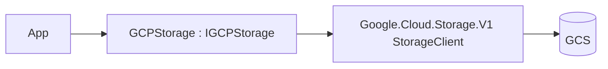

# Feature: Google Cloud Storage Provider (`ManagedCode.Storage.Gcp`)

## Purpose

Implement `IStorage` on top of **Google Cloud Storage (GCS)** using `Google.Cloud.Storage.V1`.

## Main Flows



## Components

- `Storages/ManagedCode.Storage.Google/GCPStorage.cs`
- `Storages/ManagedCode.Storage.Google/GCPStorageProvider.cs`
- DI:
  - `Storages/ManagedCode.Storage.Google/Extensions/ServiceCollectionExtensions.cs`
  - `Storages/ManagedCode.Storage.Google/Extensions/StorageFactoryExtensions.cs`
- Options:
  - `Storages/ManagedCode.Storage.Google/Options/GCPStorageOptions.cs`
  - `Storages/ManagedCode.Storage.Google/Options/BucketOptions.cs`

## DI Wiring

```bash
dotnet add package ManagedCode.Storage.Gcp
```

```csharp
using Google.Apis.Auth.OAuth2;
using ManagedCode.Storage.Google.Extensions;
using ManagedCode.Storage.Google.Options;

builder.Services.AddGCPStorageAsDefault(options =>
{
    options.GoogleCredential = GoogleCredential.FromFile("service-account.json");
    options.BucketOptions = new BucketOptions
    {
        ProjectId = "my-project-id",
        Bucket = "my-bucket"
    };
});
```

## Current Behavior

- Supports file-based auth (`AuthFileName`) and direct `GoogleCredential`.
- Bucket creation can be enabled via `CreateContainerIfNotExists`.

## Tests

- `Tests/ManagedCode.Storage.Tests/Storages/GCS/GCSUploadTests.cs`
- `Tests/ManagedCode.Storage.Tests/Storages/GCS/GCSDownloadTests.cs`
- `Tests/ManagedCode.Storage.Tests/Storages/GCS/GCSBlobTests.cs`
- `Tests/ManagedCode.Storage.Tests/Storages/GCS/GCSContainerTests.cs`
- `Tests/ManagedCode.Storage.Tests/Storages/GCS/GCSConfigTests.cs`
