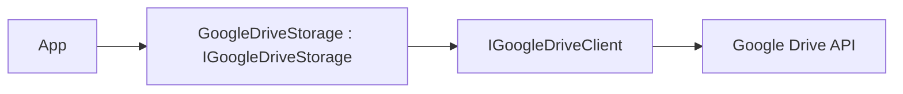

# Feature: Google Drive Provider (`ManagedCode.Storage.GoogleDrive`)

## Purpose

Expose **Google Drive** as `IStorage` so .NET apps can store files in Google Drive via the official Drive API while keeping OAuth/auth concerns in the hosting app:

- upload/download/list/delete through a consistent API
- keep auth concerns in the hosting app (you provide a `DriveService`), while still allowing a swap point for tests

## Main Flows



## Components

- Storage:
  - `Storages/ManagedCode.Storage.GoogleDrive/GoogleDriveStorage.cs`
  - `Storages/ManagedCode.Storage.GoogleDrive/GoogleDriveStorageProvider.cs`
- Client wrapper:
  - `Storages/ManagedCode.Storage.GoogleDrive/Clients/GoogleDriveClient.cs`
  - `Storages/ManagedCode.Storage.GoogleDrive/Clients/IGoogleDriveClient.cs`
- Options / DI:
  - `Storages/ManagedCode.Storage.GoogleDrive/Options/GoogleDriveStorageOptions.cs`
  - `Storages/ManagedCode.Storage.GoogleDrive/Extensions/ServiceCollectionExtensions.cs`

## DI Wiring

```bash
dotnet add package ManagedCode.Storage.GoogleDrive
dotnet add package Google.Apis.Drive.v3
```

```csharp
using Google.Apis.Auth.OAuth2;
using Google.Apis.Drive.v3;
using Google.Apis.Services;
using ManagedCode.Storage.GoogleDrive.Extensions;

var credential = GoogleCredential
    .FromFile("service-account.json")
    .CreateScoped(DriveService.Scope.Drive);

var driveService = new DriveService(new BaseClientService.Initializer
{
    HttpClientInitializer = credential,
    ApplicationName = "MyApp"
});

builder.Services.AddGoogleDriveStorageAsDefault(options =>
{
    options.DriveService = driveService;
    options.RootFolderId = "root";
});
```

## Current Behavior

- You can provide either:
  - `GoogleDriveStorageOptions.Client` (custom `IGoogleDriveClient` swap point, mainly for tests), or
  - `GoogleDriveStorageOptions.DriveService` (official SDK client)
- `RootFolderId` scopes all operations (defaults to `root`).

## Tests

- HTTP/SDK-level fake:
  - `Tests/ManagedCode.Storage.Tests/Storages/CloudDrive/GoogleDriveClientHttpTests.cs`
- Storage behaviour via fake client:
  - `Tests/ManagedCode.Storage.Tests/Storages/CloudDrive/CloudDriveStorageTests.cs`
- DI + provider plumbing:
  - `Tests/ManagedCode.Storage.Tests/Storages/CloudDrive/CloudDriveDependencyInjectionTests.cs`
  - `Tests/ManagedCode.Storage.Tests/Storages/CloudDrive/CloudDriveStorageProviderTests.cs`

## Configuration Notes

See `docs/Development/credentials.md` and `README.md` for step-by-step instructions on Drive API credentials (service account or OAuth client).
