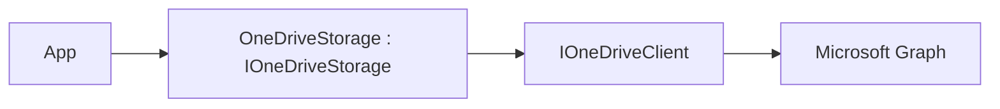

# Feature: OneDrive Provider (`ManagedCode.Storage.OneDrive`)

## Purpose

Expose **OneDrive / Microsoft Graph** as `IStorage` so .NET apps can store files in a drive/folder via Graph using the same provider-agnostic upload/download/list/delete API as other backends:

- upload/download/list/delete through a consistent API
- keep auth concerns in the hosting app (you provide a `GraphServiceClient`), while still allowing a swap point for tests

## Main Flows



## Components

- Storage:
  - `Storages/ManagedCode.Storage.OneDrive/OneDriveStorage.cs`
  - `Storages/ManagedCode.Storage.OneDrive/OneDriveStorageProvider.cs`
- Client wrapper:
  - `Storages/ManagedCode.Storage.OneDrive/Clients/GraphOneDriveClient.cs`
  - `Storages/ManagedCode.Storage.OneDrive/Clients/IOneDriveClient.cs`
- Options / DI:
  - `Storages/ManagedCode.Storage.OneDrive/Options/OneDriveStorageOptions.cs`
  - `Storages/ManagedCode.Storage.OneDrive/Extensions/ServiceCollectionExtensions.cs`

## DI Wiring

```bash
dotnet add package ManagedCode.Storage.OneDrive
dotnet add package Azure.Identity
```

```csharp
using Azure.Identity;
using ManagedCode.Storage.OneDrive.Extensions;
using Microsoft.Graph;

var credential = new ClientSecretCredential(
    tenantId: configuration["OneDrive:TenantId"]!,
    clientId: configuration["OneDrive:ClientId"]!,
    clientSecret: configuration["OneDrive:ClientSecret"]!);

var graphClient = new GraphServiceClient(credential, new[] { "https://graph.microsoft.com/.default" });

builder.Services.AddOneDriveStorageAsDefault(options =>
{
    options.GraphClient = graphClient;
    options.DriveId = "me";
    options.RootPath = "app-data";
});
```

## Current Behavior

- You can provide either:
  - `OneDriveStorageOptions.Client` (custom `IOneDriveClient` swap point, mainly for tests), or
  - `OneDriveStorageOptions.GraphClient` (official SDK client)
- Container deletion is not supported (drives/folders are account-managed).

## Tests

- HTTP/SDK-level fake:
  - `Tests/ManagedCode.Storage.Tests/Storages/CloudDrive/GraphOneDriveClientTests.cs`
- Storage behaviour via fake client:
  - `Tests/ManagedCode.Storage.Tests/Storages/CloudDrive/CloudDriveStorageTests.cs`
- DI + provider plumbing:
  - `Tests/ManagedCode.Storage.Tests/Storages/CloudDrive/CloudDriveDependencyInjectionTests.cs`
  - `Tests/ManagedCode.Storage.Tests/Storages/CloudDrive/CloudDriveStorageProviderTests.cs`

## Configuration Notes

See `docs/Development/credentials.md` and `README.md` for step-by-step instructions on Entra ID app registration and Graph auth.
