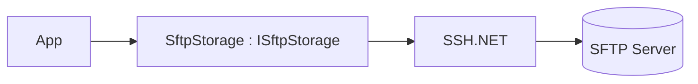

# Feature: SFTP Provider (`ManagedCode.Storage.Sftp`)

## Purpose

Implement `IStorage` on top of SFTP using SSH (for legacy systems and air-gapped environments).

## Main Flows



## Components

- `Storages/ManagedCode.Storage.Sftp/SftpStorage.cs`
- `Storages/ManagedCode.Storage.Sftp/SftpStorageProvider.cs`
- DI:
  - `Storages/ManagedCode.Storage.Sftp/Extensions/ServiceCollectionExtensions.cs`
  - `Storages/ManagedCode.Storage.Sftp/Extensions/StorageFactoryExtensions.cs`
- Options:
  - `Storages/ManagedCode.Storage.Sftp/Options/SftpStorageOptions.cs`

## DI Wiring

```bash
dotnet add package ManagedCode.Storage.Sftp
```

```csharp
using ManagedCode.Storage.Sftp.Extensions;

builder.Services.AddSftpStorageAsDefault(options =>
{
    options.Host = "sftp.example.com";
    options.Username = configuration["Sftp:Username"];
    options.Password = configuration["Sftp:Password"];
    options.RemoteDirectory = "/uploads";
});
```

## Current Behavior

- Supports password and key-based auth (`PrivateKeyPath` / `PrivateKeyContent`).
- `AcceptAnyHostKey` exists for dev/test only; production should use `HostKeyFingerprint`.
- Can create directories automatically (`CreateDirectoryIfNotExists`).

## Tests

- `Tests/ManagedCode.Storage.Tests/Storages/Sftp/SftpUploadTests.cs`
- `Tests/ManagedCode.Storage.Tests/Storages/Sftp/SftpDownloadTests.cs`
- `Tests/ManagedCode.Storage.Tests/Storages/Sftp/SftpBlobTests.cs`
- `Tests/ManagedCode.Storage.Tests/Storages/Sftp/SftpStreamTests.cs`
- `Tests/ManagedCode.Storage.Tests/Storages/Sftp/SftpContainerTests.cs`
