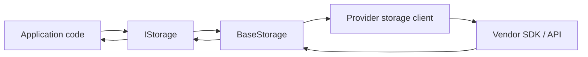

# Feature: Storage Core Abstraction (`ManagedCode.Storage.Core`)

## Purpose

Provide a single, provider-agnostic storage API for .NET so application code can upload/download/list/stream files without being coupled to vendor SDKs.

The core package defines:

- `IStorage` and related capability interfaces (`IUploader`, `IDownloader`, `IStreamer`)
- consistent `Result` / `Result<T>` error handling
- common option models (upload/download/delete/metadata/legal hold)
- provider factories (`IStorageProvider`, `IStorageFactory`) and DI helpers

## Main Flows

### 1) Upload / Download

### 2) Options-driven pathing + metadata

- Callers pass `UploadOptions` / `DownloadOptions` / `MetadataOptions` to control:
  - `FileName`, `Directory` (logical path)
  - `MimeType` (normalized through `MimeHelper`)
  - per-provider metadata where supported

## Components

Key files:

- `ManagedCode.Storage.Core/IStorage.cs` — main abstraction surface
- `ManagedCode.Storage.Core/BaseStorage.cs` — shared lifecycle + template methods for providers
- `ManagedCode.Storage.Core/Models/*.cs` — option models and `BlobMetadata` / `LocalFile`
- `ManagedCode.Storage.Core/Helpers/Crc32Helper.cs` — streamed CRC32 helpers used by chunked uploads/downloads
- `ManagedCode.Storage.Core/Helpers/PathHelper.cs` — shared path manipulation utilities
- `ManagedCode.Storage.Core/Providers/*` — provider factory abstractions and the default `StorageFactory`
- `ManagedCode.Storage.Core/Extensions/ServiceCollectionExtensions.cs` — DI helpers

## Current Behavior

- Provider implementations typically inherit `BaseStorage<TClient, TOptions>` and only implement provider-specific operations.
- Public operations return `Result`/`Result<T>` with:
  - `IsSuccess` and (when successful) `Value`
  - exceptions captured and returned as failed results
- MIME type lookups should flow through `MimeHelper` (do not add ad-hoc MIME detection).

## Tests

- `Tests/ManagedCode.Storage.Tests/Core/Crc32HelperTests.cs`
- `Tests/ManagedCode.Storage.Tests/Core/LocalFileTests.cs`
- `Tests/ManagedCode.Storage.Tests/Core/StringStreamTests.cs`
- `Tests/ManagedCode.Storage.Tests/Core/StorageClientChunkTests.cs` (core chunk behaviour used by clients)

## References

- `README.md` (package list + quickstart)
- `docs/Testing/strategy.md` (suite structure and rules)
