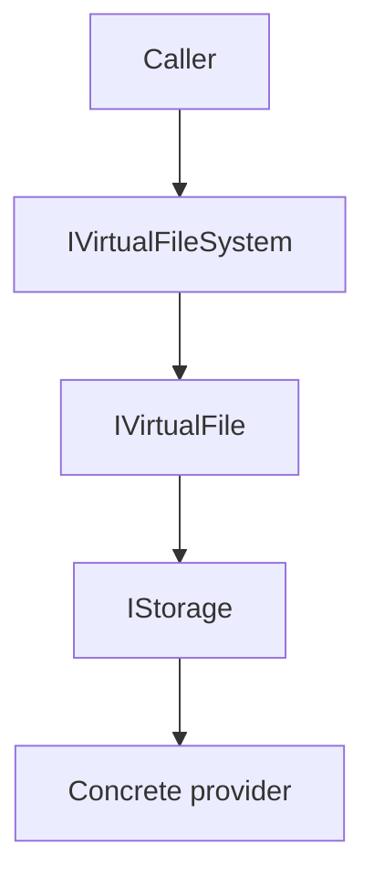

# Feature: Virtual File System (`ManagedCode.Storage.VirtualFileSystem`)

## Purpose

Expose a higher-level “virtual file system” API on top of `IStorage`:

- file/directory objects (`IVirtualFile`, `IVirtualDirectory`)
- metadata caching and convenience operations (exists, read/write streams, range reads)
- predictable behaviour across providers by routing everything through the same `IStorage` surface

This is *not* a separate cloud provider. It is an abstraction layer that sits above any configured `IStorage`.

## Main Flows

### File operations



### Directory operations

- Directory listing is implemented by prefix-listing blob metadata via `IStorage.GetBlobMetadataListAsync(...)`.

## Components

Key files:

- `ManagedCode.Storage.VirtualFileSystem/Implementations/VirtualFileSystem.cs` — VFS entry point; wraps `IStorage`
- `ManagedCode.Storage.VirtualFileSystem/Implementations/VirtualFile.cs` — file operations (`OpenReadAsync`, `OpenWriteAsync`, metadata)
- `ManagedCode.Storage.VirtualFileSystem/Implementations/VirtualDirectory.cs` — directory operations (list, delete)
- `ManagedCode.Storage.VirtualFileSystem/Core/VfsPath.cs` — path handling
- `ManagedCode.Storage.VirtualFileSystem/Options/VfsOptions.cs` — caching + defaults
- `ManagedCode.Storage.VirtualFileSystem/Streaming/VfsWriteStream.cs` — buffered write stream that uploads on dispose

## DI Wiring

```bash
dotnet add package ManagedCode.Storage.VirtualFileSystem
```

VFS requires an `IStorage` to be registered first (any provider works). Then you add the overlay:

```csharp
using ManagedCode.Storage.FileSystem.Extensions;
using ManagedCode.Storage.VirtualFileSystem.Core;
using ManagedCode.Storage.VirtualFileSystem.Extensions;

builder.Services.AddFileSystemStorageAsDefault(options =>
{
    options.BaseFolder = Path.Combine(builder.Environment.ContentRootPath, "storage");
});

builder.Services.AddVirtualFileSystem(options =>
{
    options.DefaultContainer = "vfs";
    options.EnableCache = true;
});

public sealed class MyService(IVirtualFileSystem vfs)
{
    public async Task DemoAsync(CancellationToken ct)
    {
        var file = await vfs.GetFileAsync("docs/readme.txt", ct);
        await file.WriteAllTextAsync("hello", cancellationToken: ct);

        var text = await file.ReadAllTextAsync(cancellationToken: ct);
    }
}
```

## Current Behavior

- Existence checks and metadata can be cached in `IMemoryCache` when enabled via `VfsOptions`.
- `OpenWriteAsync` currently uses a buffered write stream (`VfsWriteStream`) that uploads when the stream is disposed.
- Concurrency checks can be enforced via `WriteOptions.ExpectedETag` where supported by the underlying provider.

## Tests

- `Tests/ManagedCode.Storage.Tests/VirtualFileSystem/VirtualFileSystemTests.cs`
- `Tests/ManagedCode.Storage.Tests/VirtualFileSystem/VirtualFileSystemManagerTests.cs`
- `Tests/ManagedCode.Storage.Tests/VirtualFileSystem/*VirtualFileSystemFixture.cs` (cross-provider fixtures)

## References

- `docs/Testing/strategy.md`
