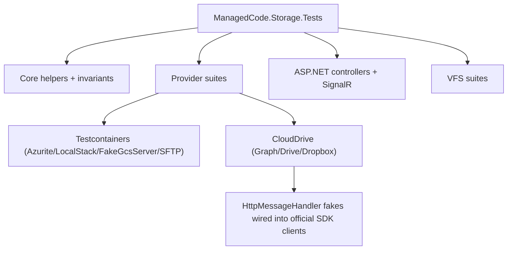

# Testing Strategy

ManagedCode.Storage uses **xUnit** + **Shouldly** and aims to verify storage behaviour through realistic flows (upload/download/list/delete/metadata) with minimal mocking.

## Test Project

- Primary suite: `Tests/ManagedCode.Storage.Tests/ManagedCode.Storage.Tests.csproj`

## Suite Map



## Structure

Tests are grouped by “surface” and provider:

- `Tests/ManagedCode.Storage.Tests/Core/` — `ManagedCode.Storage.Core` behaviour (helpers, options, invariants)
- `Tests/ManagedCode.Storage.Tests/VirtualFileSystem/` — VFS behaviour and fixtures
- `Tests/ManagedCode.Storage.Tests/Storages/*/` — provider suites (Azure/AWS/GCS/FileSystem/Sftp/CloudDrive/CloudKit)
- `Tests/ManagedCode.Storage.Tests/AspNetTests/` — ASP.NET controllers + SignalR flows (end-to-end via in-process test host)
- `Tests/ManagedCode.Storage.Tests/Common/` — shared test utilities, Testcontainers helpers, test app host

## External Dependencies

Where possible, tests run without real cloud accounts:

- Azure/AWS/GCS/SFTP suites use **Testcontainers** (Azurite, LocalStack, FakeGcsServer, SFTP container).
- CloudDrive suites (OneDrive/Google Drive/Dropbox) use `HttpMessageHandler`-based fakes wired into the **official SDK clients**, asserting real behaviour over HTTP without hitting the network.

## Categories

Some tests are marked as “large file” to validate streaming behaviour:

- `[Trait("Category", "LargeFile")]`

Run everything (canonical):

```bash
dotnet test Tests/ManagedCode.Storage.Tests/ManagedCode.Storage.Tests.csproj --configuration Release
```

Skip large-file tests when iterating:

```bash
dotnet test Tests/ManagedCode.Storage.Tests/ManagedCode.Storage.Tests.csproj --configuration Release --filter "Category!=LargeFile"
```

## Quality Rules

- Each test must assert concrete, observable behaviour (state/output/errors/side-effects).
- Mocks/fakes are allowed only for **external** systems that cannot reasonably run in tests; the fake must match the official API surface (paths, status codes, payload shapes).
- Do not weaken or delete tests to make them pass; fix the behaviour instead.
