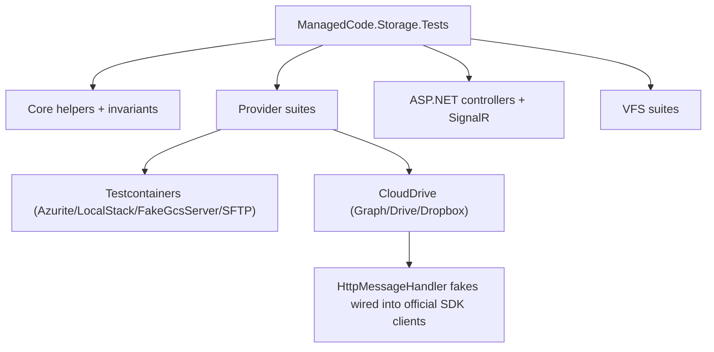

# Testing Strategy

ManagedCode.Storage uses **xUnit** + **Shouldly** and aims to verify storage behaviour through realistic flows (upload/download/list/delete/metadata) with minimal mocking.

## Test Project

- Primary suite: `Tests/ManagedCode.Storage.Tests/ManagedCode.Storage.Tests.csproj`

## Suite Map


```mermaid
flowchart TD
  Tests[ManagedCode.Storage.Tests] --> Core[Core helpers + invariants]
  Tests --> Providers[Provider suites]
  Tests --> AspNet[ASP.NET controllers + SignalR]
  Tests --> Vfs[VFS suites]

  Providers --> Containers["Testcontainers (Azurite/LocalStack/FakeGcsServer/SFTP)"]
  Providers --> CloudDrive["CloudDrive (Graph/Drive/Dropbox)"]
  CloudDrive --> HttpFakes[HttpMessageHandler fakes wired into official SDK clients]
```

## Structure

Tests are grouped by “surface” and provider:

- `Tests/ManagedCode.Storage.Tests/Core/` — `ManagedCode.Storage.Core` behaviour (helpers, options, invariants)
- `Tests/ManagedCode.Storage.Tests/VirtualFileSystem/` — VFS behaviour and fixtures
- `Tests/ManagedCode.Storage.Tests/Storages/*/` — provider suites (Azure/AWS/GCS/Browser/FileSystem/Sftp/CloudDrive/CloudKit)
- `Tests/ManagedCode.Storage.Tests/AspNetTests/` — ASP.NET controllers + SignalR flows (end-to-end via in-process test host)
- `Tests/ManagedCode.Storage.BrowserServerHost/` — minimal interactive Blazor Server host used for real browser verification of IndexedDB metadata + OPFS payload flows over server-side JS interop
- `Tests/ManagedCode.Storage.BrowserWasmHost/` — minimal standalone Blazor WebAssembly host used for real browser verification of browser storage flows with IndexedDB metadata and OPFS payloads
- `Tests/ManagedCode.Storage.Tests/Common/` — shared test utilities, Testcontainers helpers, test app host

## External Dependencies

Where possible, tests run without real cloud accounts:

- Azure/AWS/GCS/SFTP suites use **Testcontainers** (Azurite, LocalStack, FakeGcsServer, SFTP container).
- Browser-local coverage uses Playwright against `Tests/ManagedCode.Storage.BrowserServerHost/` and `Tests/ManagedCode.Storage.BrowserWasmHost/` so `ManagedCode.Storage.Browser` is exercised through real Chromium flows with IndexedDB metadata and OPFS payloads in both Interactive Server and standalone WASM modes.
- Those same hosts also wire `ManagedCode.Storage.VirtualFileSystem` over the browser provider, so browser VFS write, read, move, delete, large-file, small-file overwrite, and multi-tab concurrency flows are verified end to end in the browser rather than through in-process fakes.
- The Interactive Server host explicitly raises `HubOptions.MaximumReceiveMessageSize` so browser-to-server chunk reads can exceed the default 32 KB SignalR limit during large-stream verification.
- CloudDrive suites (OneDrive/Google Drive/Dropbox) use `HttpMessageHandler`-based fakes wired into the **official SDK clients**, asserting real behaviour over HTTP without hitting the network.

## Categories

Some tests are marked as “large file” to validate streaming behaviour:

- `[Trait("Category", "LargeFile")]`

Run everything (canonical):

```bash
dotnet test Tests/ManagedCode.Storage.Tests/ManagedCode.Storage.Tests.csproj --configuration Release
```

Install the Playwright browser for the browser-local tests:

```bash
dotnet tool restore
dotnet build Tests/ManagedCode.Storage.Tests/ManagedCode.Storage.Tests.csproj --configuration Release
dotnet playwright -p Tests/ManagedCode.Storage.Tests/ManagedCode.Storage.Tests.csproj install chromium
```

Skip large-file tests when iterating:

```bash
dotnet test Tests/ManagedCode.Storage.Tests/ManagedCode.Storage.Tests.csproj --configuration Release --filter "Category!=LargeFile"
```

## Quality Rules

- Each test must assert concrete, observable behaviour (state/output/errors/side-effects).
- Mocks/fakes are allowed only for **external** systems that cannot reasonably run in tests; the fake must match the official API surface (paths, status codes, payload shapes).
- Do not weaken or delete tests to make them pass; fix the behaviour instead.
