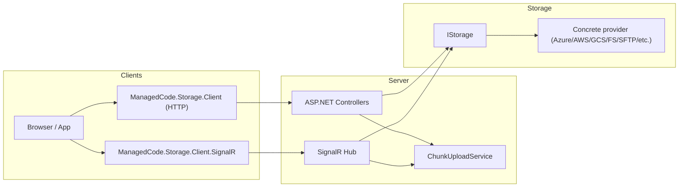

# Server & Client Streaming Enhancements

## Goals
- Provide drop-in ASP.NET controllers and SignalR hubs that expose upload, download, streaming, and chunked transfer endpoints backed by `IStorage` abstractions.
- Deliver matching HTTP and SignalR clients that can stream files, resume transfers, and interoperate with the controllers by default.
- Maintain a provider-agnostic test suite that validates the contract across file system and all cloud storages.

## High-level Architecture

## HTTP API Surface
- `POST /api/storage/upload` — multipart upload for small/medium files; stores directly via `IStorage.UploadAsync`.
- `POST /api/storage/upload/stream` — accepts raw stream (`application/octet-stream`) with `X-File-Name`, `X-Content-Type`, optional `X-Directory`; handles large uploads without buffering when possible.
- `GET /api/storage/download/{*path}` — downloads via `FileStreamResult`; supports range requests for media streaming.
- `GET /api/storage/download/stream/{*path}` — returns `IResult` streaming body for partial playback clients; enables video tag compatibility (range + cache headers).
- `GET /api/storage/download/bytes/{*path}` — returns byte array (for small files or tests).
- `POST /api/storage/chunks/upload` — accepts chunk payload (`FileUploadPayload`); stores temporary segments through `ChunkUploadService`.
- `POST /api/storage/chunks/complete` — merges chunks, optional commit to storage, returns checksum + metadata.
- `DELETE /api/storage/chunks/{uploadId}` — aborts/cleans temp chunk session.

## SignalR Hub Surface
- Hub route `/hubs/storage`.
- `Task UploadStreamAsync(UploadStreamDescriptor descriptor, IAsyncEnumerable<byte[]> stream)` — allows browser/desktop clients to push file streams chunk-by-chunk.
- `IAsyncEnumerable<byte[]> DownloadStreamAsync(string blobName)` — server streams file content down to the client.
- `Task<ChunkAck> PushChunkAsync(ChunkSegment segment)` — discrete chunk API for unreliable connections.
- `Task<TransferStatus> GetStatusAsync(string transferId)` — query current transfer progress/completion state.
- `Task CancelTransferAsync(string transferId)` — cancel inflight operations; triggers chunk session abort.

### Hub Considerations
- Back transfers with `Channel<byte[]>` to bridge between SignalR streaming and `IStorage` operations.
- Apply per-transfer quotas via configuration (`MaxConcurrentSignalRTransfers`, `StreamBufferSize`, etc.).
- Emit progress updates through `Clients.Caller.SendAsync("TransferProgress", ...)` events.

## Client Libraries

### HTTP Client (`ManagedCode.Storage.Client`)
- Add `StorageHttpClientOptions` (base URL, default headers, chunk size, retry policy).
- Provide strongly-typed methods aligning with HTTP API (upload, upload stream, download stream, chunk operations, delete, list metadata).
- Implement resumable download helper supporting range requests and CRC validation.
- Surface progress via `IProgress<ProgressStatus>` in addition to event.

### SignalR Client (`ManagedCode.Storage.Client.SignalR`)
- Implement `StorageSignalRClient` with:
  - `ConnectAsync(StorageSignalROptions options)` to configure hub URL, access token, reconnection.
  - `UploadAsync(Stream stream, UploadStreamDescriptor descriptor, IProgress<ProgressStatus>? progress, CancellationToken ct)` using SignalR streaming.
  - `DownloadAsync(string blobName, Func<Stream, Task> consumer, CancellationToken ct)` pulling server stream.
  - `PushChunkAsync(ChunkSegment segment)` / `CompleteChunkAsync(string transferId)` for manual chunk mode.
  - `CancelAsync(string transferId)` and status queries.
- Implement reconnection & resume state machine (replay chunk index).

## Configuration & Dependency Injection
- Introduce extension `services.AddStorageServerEndpoints<TStorage>()` to register controllers, chunk service, options (temp path, TTL, range defaults).
- Provide `StorageEndpointOptions` (route prefix, enable streaming, max upload size, etc.).
- For SignalR: `endpoints.MapStorageHub<TStorageHub>(options => { ... });` with convention-based registration.

## Testing Strategy
- Extend base ASP.NET controller test harness to spin up `TestApp` with new endpoints + SignalR hub.
- Implement shared tests:
  - HTTP upload/download round-trips across storages (small + large + range).
  - Chunk upload using server endpoints and verifying CRC.
  - SignalR streaming upload/download using in-memory client, verifying file integrity.
  - Cancellation + resume scenarios (HTTP 206 support, hub cancellation).
- Ensure tests run against FileSystem, Azure (Azurite), AWS (LocalStack), GCS (FakeGcsServer), Sftp.
- Measure coverage improvements; target 85%-90% by enforcing `[Trait("Category", "Integration")]` to allow selective runs.

## Backlog / Nice-to-have
- HLS playlist generation for video streaming.
- Server-sent events for progress notifications (bridge from hub to HTTP clients).
- gRPC alternative endpoints when HTTP/3 is available.
