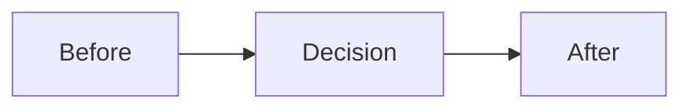

# ADR {{NNN}}: {{Title}}

- Status: Proposed | Accepted | Superseded
- Date: {{YYYY-MM-DD}}

## Context

What problem are we solving? What constraints matter?

## Decision

What did we decide and why?

## Diagram

## Options Considered

### Option A

- Pros:
- Cons:

### Option B

- Pros:
- Cons:

## Consequences

What changes as a result (code, tests, docs, operational impact)?

## Links

- Related features:
- Related code:
- External references:
