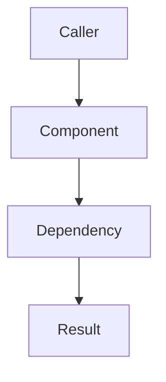

# Feature: {{Feature Name}}

## Purpose

Explain what the feature does and why it exists.

## Main Flows

Describe the primary user / system flows.

## Components

List the main code components involved (projects, folders, classes, public APIs).

- Projects:
- Key types:
- Key entry points:

## Current Behavior

Describe how it behaves today (happy path, errors, edge cases, constraints).

## Configuration

Document configuration and DI wiring (options, required secrets, environment variables).

## Tests

List the tests that cover this feature and what they assert.

- Existing tests:
- Gaps / TODO:

## Definition of Done

- Core flow is implemented and documented.
- Automated tests verify real behaviour (not only mocked interactions).
- `dotnet test` passes for the repository test project.
- Docs updated (README + `docs/`).

## References

- Related docs:
- Related ADRs:
- External specs / SDK docs:

